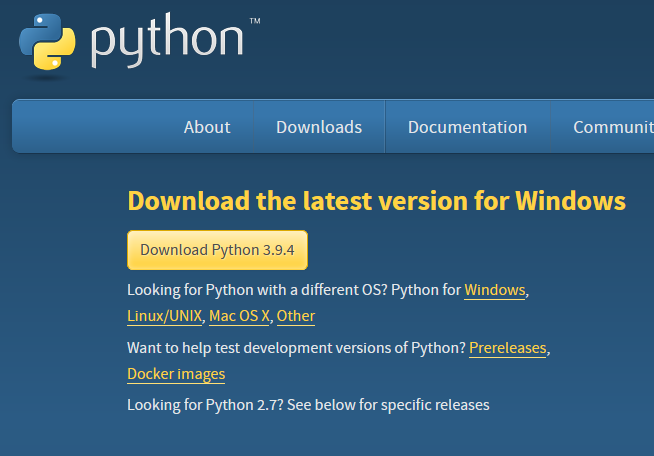

# learn<span>.</span>py Session 1: Introduction to Python

**Date**: April 7, 2021

**Location**: Zoom

**Teachers**: [Nareh Agazaryan](https://github.com/nareha), [Einar Balan](https://github.com/EinarBalan)

## Resources

- [Slides](https://docs.google.com/presentation/d/1ATyV4KLqf9qmk8kfnXwJpChtq_fwGhTMVzowa_NdCnU/edit?usp=sharing)
- [ACM Membership Attendance Portal](https://members.uclaacm.com/login)

## What we'll be learning today
- [Downloading Python & Using the interpreter](#downloading-python--using-the-interpreter)
- [Variables](#Variables)
    - Numbers and Math operations
    - Strings, String Operations, and Escape Sequences
    - print() and input()
    - Lists and Basic List Operations
    - Mutability of Variables
- [Conditionals](#conditionals)
    - Booleans, Operators
    - White space
- [Loops](#loops)
    - while
    - for
        - Containers
        - Range
- [Functions](#functions)
    - Parameters by value/reference
    - None
    - Documentation
    - Default arguments
    - Keyword vs positional arguments
    - Arbitrary argument lists
    - First class functions

> Note: This workshop series is designed with the assumption that attendees have taken CS31/PIC10A, or any of its equivalents. While we will go through the basics of Python, we do not explain all the details and fundamentals. Rather, we are showing how to what you have previously done, but within Python.

## Downloading Python & Using the interpreter
What exactly is Python? There are many technical definitions for programming languages, we may define it simply. Python is one of the world's fastest growing languages amongst many audiences, not just software developers! It's highly applicable, as it is great for many tasks other than creating software, such as data analysis, AI/ML (Artificial Intelligence/Machine Learning), and automation (which, hint hint, will be in a future workshop!).

Why exactly do we use Python over other languages? Python is great for solving large, complex problems with simpler and fewer lines of code. Of course, as the problems get more complex, it requires more knowledge of Python, but in general there are some problems that can simply done in shorter lines of code (i.e. as we'll see later, the infamouse first "Hello, World" code!). Additionally, Python is cross-platform, meaning you can create and run Python application on any device! Lastly, Python syntax (coding style and convention) is a lot simplier,  relying on whitespace, which we'll learn later on in this workshop. If you've used a language such as C++ before, you may be familiar with the use of semicolons and curly braces. Python doesn't use any of that! How convenient!

Getting started with Python requires downloading Python. Visit [this site](www.python.org/downloads/). You will see a large yellow "Download Python" button. IF you are on Windows, click this button. Otherwise, there are links immediately below for your particular operating system (you may need to do this for certain versions of Windows, but it is likely that the main button will be sufficient, unless you are on a legacy version of Windows, for example).



It's required to download Python in order to have the ability to compile Python code. In order to test and experiment code, you may use the Python interpreter or IDLE. While IDLE has more capabilities, for our purposes we will view them as working similarly. IDLE is Python's Integrated Development and Learning Environment. Both the interpreter and IDLE run under a process known as REPL (Read, Evaluate, Print, Loop). The Python code is read, evaluated, the result is printed on the screen, then the interpretter loops agin to read the next line of inputted code. Don't worry about the specifics at this point, though it does get quite useful for your other possible future Python uses, so we'll be demonstrating some concepts in here to get you familiar with it. For now, think of it like the console in the browser, if you've ever used the console for messing with JavaScript.

To use the interpreter, you type: \
    - `py` on Windows \
    - `python3` on MacOS

To use IDLE, on Windows you can search it within your start menu, or if you're on MacOS, type `idle3`.

## Variables
If you've coded in other languages, you will most likely be familiar with variables. There are some similarities within Python to other languages, as well as differences.

Variables are a space in memory that have a certain given value. We give it a name to retrieve its value. For example, `remy = 'chef'` is an example of a *string* which we'll dive into in a little bit. It is similar to other languages in that we have a variable name, a value, and we use `=` as our assignment operator (giving the variable a value). 

You always want to have meaningful names for your variables. For example, if I were making a game and wanted to make a character called Remy, like on the previous slide, I wouldn’t want to name him “rat1”, because it would be hard to know who it was referring to!


Compared to C++, for example, you do not specify the type of the variable name, as it can be changed later on. This is another reason to have meaningful variable names.

There are many types of variables, but the ones we will cover today are: \
    - Numbers \
    - Strings \
    - Lists \
    - Boolean

**Numbers**: There are two types of numbers, int and float. int / integer represents whole numbers, while float represents decimals. Compared to C++, there are no doubles, longs, or shorts.

Examples of int are:
```python
    num_friends = 0
    sheep_counted = 4326
```

Examples of float are:
```python
    my_gpa = 1.74
    threefourths = 0.75
```

There is a host of different mathematical / arithmetic operations that can be applied to numbers in Python.

- Addition and Subtraction = `+     -`

- Multiplication and Decimal Division = `*     /`

- Floored/Integer Division = `//`

- Exponentiation = `**`

- Modulus (Remainder of division) = `%`


**Strings**: Strings can be a single letter, words, sentences, or big blocks of text. You can use either 'string quotes' or "double quotes" for single line strings. For multi line stringls, you may use triple single or triple double quotes.

```python
single_quote_string = 'Single quotes are better!'

double_quote_string = "No, double quotes are better!"

multi_line_string = '''Imagine
                       only using
                       one line.'''
```

Strings can be concatenated (glued together) using the + operator, or by simply being put next to each other! \
`'I like ' + 'Python'  =>  ‘I like Python’` \
`'I like ' 'Python'  =>  ‘I like Python’` 
- This is called implicit concatenation!

You may also repeat the same string using the `*` operator. \
`3 * 'Hacc Squad'  =>  'Hacc SquadHacc SquadHacc Squad'`


**Escape Characters**: What if we wanted to put some speech inside of a string? \
`rat_quotes = 'As Remy says, 'Change is nature'.'` \
This would give us an error!

Instead, we can use the escape character to put in these special characters. We use a backslash (`\`) to do so. \
`rat_quotes = 'As Remy says, \'Change is nature\'.'` \
Without this, Python will read until the next single-quote, which is right before "Change", and will see that there is incorrect syntax following the string, and throw an error!

There are many special characters that require an escape character, such as:
- `\n`  =>  New line

- `\t`   =>  Tab

- `\\`  =>  Backslash within a string as text

Without the backslash, these texts would be read literally rather than with our intended character.

**Basic Input and Output**: The simplest way to display some text on the screen is with print()! \
`print('Hello')`  =>  Hello \
`print(06292007)`  =>  06292007 \
You can pass any value and any variable to print!

This is where Python shines. While in C++, you may have had to write multiple lines just to print "Hello, World!", like so:

```c++
#include <iostream>

int main()
{
    std::cout << "Hello, World!" << std::endl;
    return 0;
}
```

While in Python, we can just do the following:

```python
print("Hello, World!")
```

How convenient!


Asking for input works simply as well! The general format works as the following: \
`var_name = input("Some sort of prompt")`

The user then gets the prompt on the screen, and will be asked to input something. All input is stored as a **string**. `var_name` now stores whatever the user entered!
You may also leave input blank, but it is helpful to leave some message for users to know what you ask, otherwise it may be ambiguous what kind of input you are looking for.


**Lists**: Similar to an array in C++, a list is a group of ordered values. You can put different types into the same list, but commonly and ideally, you would have just one type for all elements. By ordered, we mean that the order that you add them in, as you add to the end, will stay in the same place. The first item will always be the first regardless of what you add to the end.

We may take a list to be declared like the following.

```python
my_favorite_numbers = [24, 1, 5, 100]
```

You may replace a certain value using its index, which is the location of a certain value, starting with 0 as the first position. If I wanted to replace the number 5 in the list above:

```python
>>> [24, 1, 5, 100] # Initial
my_favorite_numbers[2] = 3
>>> [24, 1, 3, 100] # Result
```

We simply use the brackets to designate the position we want to modify, and *assign* the new value to that position!

Additionally, we may add new values to the end of the list using `append()`.

If I wanted to add the number 7,

```python
>>> [24, 1, 3, 100] # Initial
my_favorite_numbers.append(7)
>>> [24, 1, 3, 100, 7] # Result
```

**Mutable vs Immutable Types** \
An important concept within Python is the idea of mutability. Simply put, types that are *mutable* can be changed after creation, while immutable types cannot. This does not refer to `const` types. We are still able to change the value, or even change the type of that variable to another type. Mutability means that you can change the property of the variable *without* changing its identity. This is important to know, especially as we delve deeper into future workshops, since the mutability of a certain type may determine which one you may choose over another in certain situations. Immutable are quicker to access than mutable objects, while mutable objects are great to use when you need to change its size, like in a list.

From the types we have covered so far, **int, float, and string** are immutable, while **list** is mutable.

We can view what happens under the hood with `id()` in Python. `id()` simply returns the unique id for the particular variable. We can view mutability through this to understand what exactly is being changed and what is not.

Let's take ints for example,
```python
x = 5
y = x

# At this point, id(x) == id(y)

x = 3

print (y) # y will still be 5, even though x is 3!
          # Additionally, id(x) != id(y). It is an entirely new variable, rather than pointing to the same old one.
```

This works similarly with strings and floats. For mutable types such as list, however, we can view its mutability using `id()` as well.

Say we have some list `y`, doing `y.append(3)` and `y[1] = 7` can be done directly without needing to reassing our list an entirely new list with those values, for example, whereas in the int example, changing y would require reassigning it. Further,

```python
some_list = [1, 2, 3]
x = some_list # x and some_list are the same...
x.append(7) # some_list will also have the added 7, even though this was added to x!
```

Using `id()` to demonstrate,
```python
my_list = [1, 2, 3]
z = my_list

# id(z) == id(my_list)

x.append(7)

# Even now, id(z) == id(my_list)!
>>>

```


Mutability is tricky to grasp at first but is a critical concept.
 
## Conditionals
If you've seen conditionals in other languages, conditionals in Python won't surprise you. Keeping with the theme of the language, though, there are a couple differences designed to make your life easier!

Here's what a typical conditional statement looks like in Python:
```python
if anyone_can_cook:
    print("r a t")
```

You can probably already spot a couple differences compared to other languages, but let's go through them one at a time:
- parentheses are optional
- no curly brackets (colon instead)
- white space matters!
    - official documentation recommends using 4 spaces instead of tabs

> Note: If I add more statements below the conditional, they only belong to that conditional if they are at the required indentation level.

i.e. The following two blocks will be treated differently.
```python
if anyone_can_cook:
    print("r a t")
    print("I don't like food,")

    print("I love it.")
```
&
```python
if anyone_can_cook:
    print("r a t")
    print("I don't like food,")

print("I love it.")
```
-----

### Quick Aside on Boolean Conditions
The statement following the `if` keyword is evaluated in exactly the same way as in other languages. If it evaluates to `True` (notice the capitalization), then the body of the conditional will be executed. If `False`, then it won't be. In Python, non-empty collections and numeric values that are not 0 are evaluated as True. All other values are False. See the table below for reference.

| | Truthy | Falsy |
|-|--------|--------|
| True |   x     |      |
| False |        |   x   |
| 1 |     x   |      |
| -12123 |    x    |      |
| 0 |        |   x   |
| [ ] |       |   x   |
| [1, 2, 3] |   x    |      |
| "" |       |  x    |
| "ratatata" |   x    |      |

<br>
I'll gloss over comparison operators, but know that they work exactly as you would expect, with the exception of logical and being written as "and" and logical or being written as "or".

------

There are also else statements!

```python
if anyone_can_cook:
    print("r a t")
else:
    print("m a n")
```

And they work in exactly the same way. How about else if's? In other languages you might be familiar with such as C++, there is no designated else if key word. Instead, the language takes advantage of the fact that white space is ignored to create easy to read statements, like so:

```C++
if (anyoneCanCook) {
    std::cout << "r a t" << std::endl;
}
else if (notEveryoneButRatsCan) {
    std::cout << "r a t !!" << std::endl;  
}
else {
    std::cout << "m a n" << std::endl;
}
```

Unfortunately, this won't work quite as nicely in Python due to the strict enforcement of white space. Here is a direct translation to Python:

```python
if anyone_can_cook:
    print("r a t")
else:
    if not_everyone_but_rats_can: 
        print("r a t !!")
    else: 
        print("m a n")
```

Luckily, we can do better thanks to a new keyword that Python introduces: `elif`. Here's what the above code would look like when using `elif`.

```python
if anyone_can_cook:
    print("r a t")
elif not_everyone_but_rats_can: 
    print("r a t !!")
else: 
    print("m a n")
```

Much cleaner!

> Note: As of Python 3.9.1, there's no switch statement. Keep your eye out though because this will be changing soon (match statements)!

## Loops

### while
Just like conditionals, while loops behave more or less the same as in other languages:

```python
while num_ingredients:
    num_ingredients -= 1
    print("lost ingredient")
```
> Note: there are no increment/decrement operators in Python.

### for
For loops, on the other hand, take quite a different approach than in languages like C++. Here's a look at the syntax: 

```python
for word in ["anyone", "can", "cook"]:
    print(word)
```
As you can tell, for loops in Python read a lot more like actual English, which, as we progress, you'll notice is a running theme of the language. Python's for statement will iterate over the items of a sequence/collection (which we'll define later on but for now it's sufficient to know they're simply container types) in the order that they appear. 

This decision to limit for loops to iteration makes some things a lot more convenient and some things less convenient. For example, how can we easily iterate through a range of numbers or execute a statement a particular number of times? Well, you could just use a while loop. If you wanted to use a for loop, however, you would need to use `range()`.

```python
for num in range(10):
    print(num) # prints sequence from 0 to 9

for num in range(20, 10, -2):
    print(num) #prints even numbers from 20 to 12

```

Just like a list, range is a sequence type that allows you to iterate over some specified range of numbers. 

`range` has the following prototype, as described in the Python documentation,
```python
range(stop)
range(start, stop[, step])
```

### Looping Techniques
Python lets you do a LOT of cool things in relation to looping that will result in extremely clean, elegant code. Unfortunately, our time is limited today so we'll have to defer it to next time. I promise you don't want to miss it though! You can't have clean, elegant code without some level of abstraction, though, and that's where functions come in!

## Functions
Alright, now we're getting to some *fun* stuff. Get it? Fun?? Haha okay bye

But seriously functions in Python are both very simple and very powerful, so let's take a look! 

The basic syntax for a function is as follows:
```python
def f(x, y):
    # do something

f(42, ["hello", "there"]) #ways to call f
f(y="hey", x=99)
f("hey", y=99)
```

where x and y can be any type. The default return value if not specified is a value called `None` which is analagous to `null` in other languages.

An important note to understand is that immutable types (i.e. integers, strings, floats, etc) are passed by value while mutable types (lists, dictionaries, etc) are passed by reference. This means that changing the local value of an immutable argument will not change its value beyond the scope of the function. 

> Note: There are no pointers in Python! You're just going to have to remember which data types are mutable and which are immutable. 

### Fun with Arguments
The main way Python functions differ from functions in lower level languages is in the immense flexibility of the arguments. As an example, let's take a look at the print function's documentation.

```python
print(*objects, sep=' ', end='\n', file=sys.stdout, flush=False)
```

Woah! That looks a lot more complicated than expected. Let's break it down.

1. The first argument `*objects`, allows the user of the function to enter an arbitrary number of arguments into the function. In the case of `print()`, each of these arguments is printed in order with the `sep` string between them.

2. The remaining 4 arguments have default values provided to them. As a result, they're optional when calling the function.

This flexibility allows the designer of a library to hide away much of the complexity of the function! 

Let's design a function called `concat()`, which will take an arbitrary number of strings and return a single string with them all joined together. Let's also allow the user of the function to speficy a string to separate each string.

```python
def concat(*args, sep=""):
    return sep.join(args)
```

See how simple that was! Granted it was because there already is a function that did most of the work for us, but still! Now we can call our `concat()` function as follows:

```python
concat("anton", "ego", "is", "a", sep=" ") # returns "anton ego is a "
concat("r", "a", "t", "a", "t") # returns "ratat"
concat() # returns ""
```

> Note: the `sep` argument is called a keyword-only argument because it can only be specified in a function call by its keyword. All arugments following an arbitrary list argument are keyword-only argmuments. Otherwise, how would Python know which argument the parameter belongs to?

### First Class Functions
In Python, functions are known as first class objects meaning they can be assigned to variables and passed as arguments to other functions. 

For example the following code is valid:
```python
def f(x):
    return x **	2

g = f

print(g(5)) # prints 25
```

as is 

```python
def transform_by(fun, x):
    return fun(x)

def some_func(i):
    return i ** i

transform_by(some_func, 3)
```

## Wrapup
Alright, that was a ton of information! I encourage you to go back and reread sections that were confusing, and if you still don't get it feel free to reach out! We're always happy to help on the ACM discord :)

