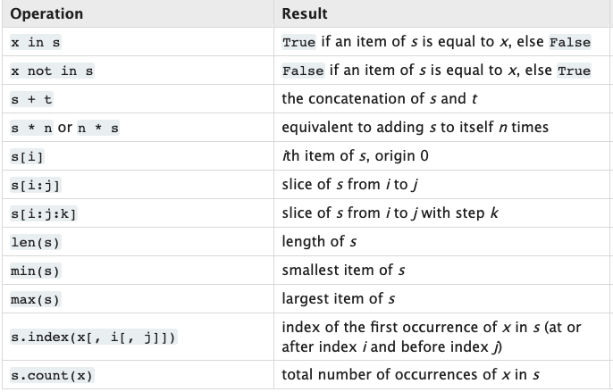

# learn<span>.</span>py Session 2: Data Structures in Python

**Date**: April 14, 2021

**Location**: Zoom

**Teachers**: [Einar Balan](https://github.com/EinarBalan), [Nareh Agazaryan](https://github.com/nareha)

## Resources

- [Slides](https://docs.google.com/presentation/d/1PvyGrX8Lxqzl3lpHhAwIUvFeuixkCE3hU-MGUdDtyMc/edit?usp=sharing)
- [ACM Membership Attendance Portal](https://members.uclaacm.com/login)

## What we'll be learning today
- [Sequences](#Sequences)
    - common operations
    - `in`
    - slicing
- [Tuples](#Tuples)
    - sequence unpacking
- [List Comprehension](#list-comprehension)
- [Lambdas](#Lambdas)
- Stacks & Queues
- Collections
- Sets
- Dictionaries

## Recap
Last week, we showcased lists and explained that they are a container type in Python similar to resizable arrays in other languages. A key takeaway from our discussion was that lists are a **mutable** type.

 ### As a reminder:
> **mutable**: value can change after initialization <br>
> **immutable**: value cannot change after initialization

Lists are by far the most common structure to store ordered data, but Python offers several alternatives. Today, let's take a look at a couple of them! We'll explore use cases, implementations, and some *really* awesome Python-specific features for each one. First though, let's start with the foundation of all ordered data in Python: Sequences.

## Sequences
So what exactly is a sequence? Essentially, it's just a group of items that have some kind of ordering. Based on this definition, it's pretty clear that a list is a type of sequence (since elements in lists are ordered by their indices). In fact, so far we've shown you three sequence types: lists, strings, and ranges. 

```python
# All of these are sequences! 

li = [99, "h-e-l-o", False]
s = "~data structures~ 😎"
r = range(1, 100, 2)
```

Sequence types in Python have a set of **common operations** that can be applied to them, which is really convenient for us! Here's a quick overview:



I won't be covering them all in depth, but there are a few I want to highlight due to how useful they can be, such as...

### `in` Operator
Very often in our programs we want to determine if there is a certain value within a sequence type.

Suppose we wanted to determine if the value, `42`, was in some list, `meaning_of_life`. We could take the DIY approach as follows:

```python
for meaning in meaning_of_life:
    if meaning == 42:
        print("42 is in meaning_of_life!")
```

But this takes up 3 *whole* lines of code. We can do better with the `in` operator which is used as such: `x in s`. The expression will return `True` if the value `x` is contained within the sequence `s`. Let's rewrite our code from before:

```python
if 42 in meaning_of_life:
    print("42 is in meaning_of_life!")
```

Looks a lot nicer, right? Thank you Python developers <3

And of course, just like all the other sequence operators I showed before, `in` can be used with any sequence type.

```python
# All of this is valid! 

>>> False in [99, "h-e-l-o", False]
    True

>>> "ruct" in "~data structures~ 😎"
    True

>>> -99 in range(1, 100, 2)
    False
```

> Note: the `in` used above is not the same as the `in` used in for loops!

### Indexing and Slicing
All sequences can be **indexed** in Python using the square bracket operator. For example, to get the element at the second index in a list:

```python
>>> li = ["hello", [a, b, c], -3, 2300.5]
>>> li[2]
    -3
```

You can also use negative values to retrieve values from the opposite end of a sequence. To get the last element in a sequence:

```python
>>> li = ["hello", [a, b, c], -3, 2300.5]
>>> li[-1]
    2300.5
```

**Slicing** is another super useful sequence operation! It allows you to concisely form subsequences based on an existing sequence. For example, if I wanted to get all the elements of a sequence from the 2nd index to the 5th index:

```python
>>> li = ["zero", "one", "two", "three", "four", "five", "six", "seven", "eight"]
>>> li[2:6]
    ["two", "three", "four", "five"]

```

More generally, the syntax for slicing is as follows:

```python
sequence[i:j:k]
```

- where i, j, and k are integers
- i is the inclusive starting index
- j is the exclusive stop index
- k is the step

You can also leave certain fields blank. For example:
```python
>>> [0, 1, 2, 3, 4, 5][:2] # i and k are blank
    [0, 1]

>>> [0, 1, 2, 3, 4, 5][2:] # j and k are blank
    [2, 3, 4, 5]

>>> [0, 1, 2, 3, 4, 5][:] # i,j, and k are blank
    [0, 1, 2, 3, 4, 5]   

 >>> [0, 1, 2, 3, 4, 5][::2] # i and j are blank
    [0, 2, 4]
>>> [0, 1, 2, 3, 4, 5][::-1] 
    [5, 4, 3, 2, 1, 0]
```

One really important thing to understand is that slicing creates **shallow copies**, not deep copies! This means that nested values are not copied, but merely referenced (i.e. they have the same id).

> Note: If the sequence type you're dealing with is mutable, you can use splicing to update the section of the sequence you specify! Check out the docs linked below for more information.

### Key Takeaway
If you take anything away from this discussion, let it be that all sequence types in Python have a set of common operations that can be performed on them. I can't cover them all but I highly recommend checking out [this](https://docs.python.org/3/library/stdtypes.html#:~:text=There%20are%20three%20basic%20sequence,%2C%20tuples%2C%20and%20range%20objects.) website if you're interested in seeing more (particularly about mutable sequences)! 

## Tuples
Tuples are another sequence type in Python (meaning all the same operations from before still apply!). A tuple, much like a list, is simply a general sequence of elements. Tuples can be declared as follows:

```python
t = (1, 2, 3, 4)
t = 1, 2, 3, 4 # parentheses optional!
t = () # empty tuple
t = (1, ) # single element tuple
```

> Note: single element tuples *must* include a trailing comma.

Tuples differ from lists in one very significant way: they're immutable. That means it's not possible to reassign, remove, or insert any elements into an initialized tuple. Note that it is possible to reassign mutable objects within tuples (i.e. lists within tuples).

I know what you're thinking. Why the hell would I ever want to use a tuple over a list?

The short answer is for **optimization**. Tuples take up less space than lists and can be initialized significantly faster. As a result, if there's ever a case where you know that you won't change the values in a sequence, consider placing them in a tuple over a list.

Very often, tuples are used for **heterogenous sequences**, or sequences of different types and the elements in the tuple are accessed via **unpacking**.

### Sequence Unpacking
Unpacking is once again applicable to all sequence types, but it is especially relevant in the case of tuples because it allows for some very nice syntactic sugar (which we'll get to in a second).

Unpacking allows you to directly assign all elements in a sequence to a variable, as follows: 
```python
>>> t = ("a", "b", "c")
>>> x, y, z = t
>>> print(x, y, z)
    a b c

# can be done with any sequence type
>>> t = ["a", "b", "c"] 
>>> x, y, z = t
>>> print(x, y, z)
    a b c
```

Notice that the first variable is assigned to the first element in the sequence, the second variable is assigned to the second element, and so on.

Like I mentioned, unpacking tuples allows for some very convenient syntax:

```python
# assigning multiple variables at once
a, b, c, = 1, 2, 3

# swapping the values of variables
x, y = y, x
```

It's because of simple things like this that Python has won my heart : )

## Demo
Let's write a function that, given two lists, will return a list of every possible pairing of elements between those two lists. If you care, this is called the [Cartesian Product](https://en.wikipedia.org/wiki/Cartesian_product). Let's also add a restriction that given each pairing, each element must be distinct.

There are a ton of ways we could approach this, but let's first take the most obvious route: using loops.

```python
def cart_product(l1, l2):
    result = []
    for i in l1:
        for j in l2:
            if i != j:
                result.append((i, j))
    return result
```

This technically works, but its super ugly to look at! Too much indentation for my tastes 🤮

Let's explore some other options. 

## List Comprehension
List comprehension is a concise way to generate a list from another list in a simple, readable, and elegant way! In order to see just how magical it is, let's transform our cartesian product function from before to use list comprehension.

```python
def cart_product(l1, l2):
    return [(i, j) for i in l1 for j in l2 if i != j]
```

We went from 7 lines of code to just 2. Woah!

Here's the general syntax:

```python
[expression for iterator in iterable if condition]
```
Let's break it down a bit. There are 3 distinct sections: the expression to be added to the list, the iteration, and the condition. For each iteration of the loop, if the condition is met then the expression will be evaluated and added to the resulting list generated by the comprehension (the if condition can also be left off to add values unconditionally). You can also nest multiple loops, as I showed in the `cart_product()` example.

It's definitely possible to go slightly overboard with list comprehensions and make them a bit unreadable, so make sure not to get too carried away! 

## Lambdas
Sometimes it becomes convenient to create anonymous functions (i.e small functions that don't have a name) and pass those around instead of doing the typical declaration. In these cases, we use lambdas! Here's a look at the progression in syntax from a simple `def` function to a `lambda`. Note that none of the intermediates are valid functions.

```python
# normal function declaration
def sum(a, b, c):
    return a + b + c

# start transition
def (a, b, c):
    return a + b + c

         |
         V

lambda (a, b, c):
    return a + b + c

         |
         V

lambda (a, b, c):
    a + b + c

         |
         V

lambda (a, b, c): a + b + c

# lambda expression
lambda a, b, c: a + b + c
```

The lambda expression above (which represents a sum of three values) can then be assigned to a variable or passed around just like any other function in Python.

An important limitation of lambdas to keep in mind is that they are restricted to single expressions for their return values. This means they can only be used for small functions as shown above!

Lambda's (as well as the fact that functions are first class objects) are key to Python's status as a multi-paradigm programming language. They allow the langauge to be used in a functional way. Next week, we'll take a look at an object-oriented approach to Python.