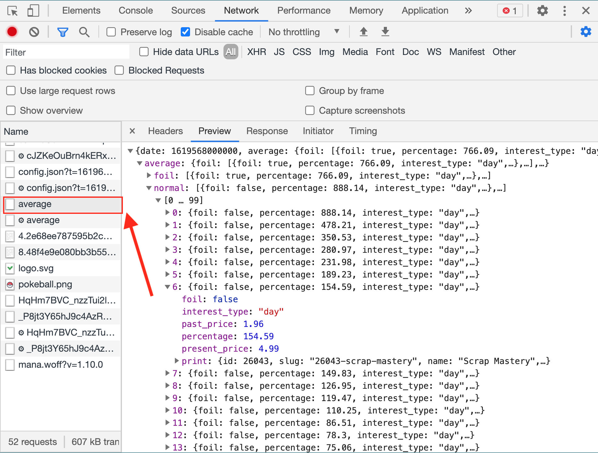
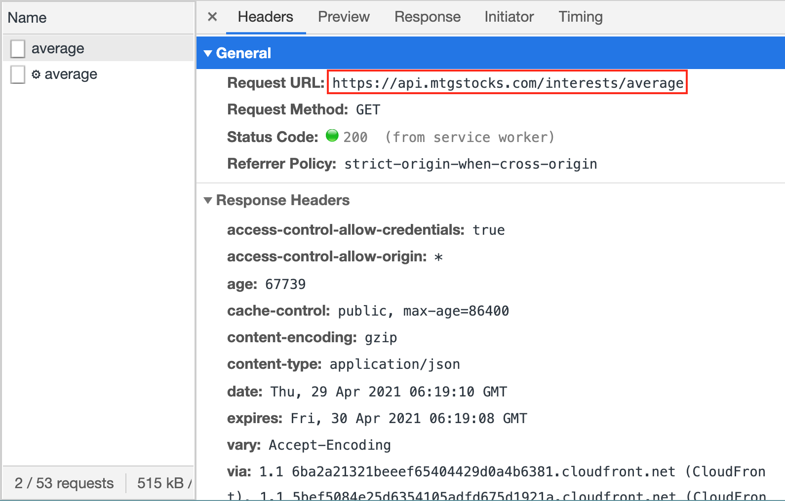

# learn<span>.</span>py Session 5: Web Scraping <!-- omit in toc -->

**Date**: May 5, 2021

**Location**: Zoom

**Teachers**: [Timothy Rediehs](https://github.com/timthetic)

## Resources <!-- omit in toc -->

- [Slides](links.uclaacm.com/learnpy21-s5-slides)
- [ACM Membership Attendance Portal](https://members.uclaacm.com/login)

## What we'll be learning today <!-- omit in toc -->
- [What is Web Scraping](#what-is-web-scraping)
	- [Note: Ethics and Web Scraping](#note-ethics-and-web-scraping)
- [Goal and Motivation](#goal-and-motivation)
	- [Things to Try Before Web Scraping](#things-to-try-before-web-scraping)
- [Installing Selenium (and Requests for later...)](#installing-selenium-and-requests-for-later)
	- [Installing on Windows](#installing-on-windows)
	- [Installing on Mac/Linux](#installing-on-maclinux)
- [Some Groundwork Knowledge](#some-groundwork-knowledge)
	- [Trees](#trees)
	- [HTML](#html)
- [JavaScript: A Wrench in the Plan](#javascript-a-wrench-in-the-plan)
- [Demo: Scraping mtgstocks](#demo-scraping-mtgstocks)
	- [Background](#background)
	- [The HTML of MTGStocks](#the-html-of-mtgstocks)
	- [Outline](#outline)
	- [Code: Start](#code-start)
	- [Code: Card Class](#code-card-class)
	- [Code: get_cards()](#code-get_cards)
	- [Code: look_for_favorite_cards()](#code-look_for_favorite_cards)
	- [Code: We're done!](#code-were-done)
	- [Tip: Store Data to Prevent Excessive Requests!](#tip-store-data-to-prevent-excessive-requests)
- [Reverse Engineering](#reverse-engineering)
- [Demo: Reverse Engineering](#demo-reverse-engineering)

## What is Web Scraping
Web scraping is the (usually automated) process of extracting data from the web. For example, if you manually used the internet to take note of a few stock prices then you are technically web scraping. Our goal, however, is to automate this mundane task. How do we do this? Well, a lot of websites will repeat similar elements to display information. These elements are usually formatted the same way, so we can search for these elements and find what we want easily. Patterns and repetition are some of the most important things in web scraping. How might a page be organized such that you know where to find information easily?

### Note: Ethics and Web Scraping
* Make requests at a conservative rate (do not DDoS people)
* Don't pass a site's data as your own
* Don't scrape data you are not authorized to have
## Goal and Motivation
**Our Goal**: We want to be able to write a program that can automatically find useful information on webpages

### Things to Try Before Web Scraping
* **Use a Web API**: Some sites will provide APIs or Application Programing Interfaces that you can "ask" for the information you want. Accessing these APIs may cost money or be free. However, sites don't always have this convenient option.
* **Reverse Engineering**: When you access a webpage, you're browser makes several requests. Sometimes, one of those requests is for exactly the data you care about. By inspecting the behavior of the site, you might be able to find this request.

## Installing Selenium (and Requests for later...)
* A text editor (like Sublime or VS Code or Vim)
* Python
* Requests
* Selenium
* A web driver for Selenium (I will use chromedriver)
    * **Note**: I will use ChromeDriver for Google Chrome.  I suggest you do too.
    * **Note**: Which ever web driver you use you will need the corresponding web browser.

### Installing on Windows
* Open Powershell/Command Prompt
    * `pip install requests`
    * `pip install selenium`
* Follow this [link](https://pypi.org/project/selenium/)
    * Scroll down to the [drivers section](https://pypi.org/project/selenium/#drivers) and click the link for your browser.  I will plug Chrome again here.
    * Download the web driver version that corresponds to your web browser version.
    * You're done!  Just remember where the driver file is.  We'll need it later.
* Check it it worked with `pip list`!  You should see requests and selenium listed.

### Installing on Mac/Linux
* Open Terminal
    * `pip3 install requests`
    * `pip3 install selenium`
* Follow this [link](https://pypi.org/project/selenium/)
    * Scroll down to the [drivers section](https://pypi.org/project/selenium/#drivers) and click the link for your browser.  I will plug Chrome again here.
    * Download the web driver version that corresponds to your web browser version.
        * You can check Chrome's version by clicking the **three dots** on the top right of the screen → **Help** → **About Google Chrome**
    * You're done!  Just remember where the driver file is.  We'll need it later.
* Check it it worked with `pip3 list`!  You should see requests and selenium listed.

## Some Groundwork Knowledge
When we are web scraping, we are really just searching an HTML file for information we want. Because of this, we have to talk about HTML and, more generally, trees.

### Trees
It's just like a family tree! Note that a descendant and ancestor also take their meanings from a family tree.  


### HTML
As we talked about in our web dev session. HTML is a markup language used when creating webpages.  Since HTML is how webpages are generally represented, we need to have a basic knowledge of how it works. However, we don't care about what each tag does or how to write HTML anymore.  We care only about the **structure** of and HTML file and how to **search and navigate** though it.

An HTML file is structured as a tree.  This means that there is one big element, the `<html>` element, that contains many **children** elements within it.  Each element inside can also have more elements in it and so on.  


A lot of web pages will **reuse elements**.  We can use this to our advantage because the format of the file becomes repetitive and predictable. We will see an example of this when we start web scraping.

## JavaScript: A Wrench in the Plan
Before pages were commonly rendered on the client using JavaScript, it was often effective to request a page, then search that page for information. However, if you try that on a page rendered with javascript, you will usually find yourself searching a page with little to no content.

Because of the prevalence of JavaScript rendered pages, we will instead use **Selenium** to control a web browser to get the information we need.

## Demo: Scraping mtgstocks
### Background


Did you know that Magic: The Gathering cards are practically as liquid as the US dollar? Where a normal person sees a game piece, others see a way to [revel in riches](https://gatherer.wizards.com/pages/card/Details.aspx?multiverseid=435271). The prices of MTG cards functions very similarly to the prices of stock. In fact, many economic principles of supply and demand apply here as well. For example, Wizards of the Coast just printed a red and white deck that does not include, but works well with a red cards called "[Scrap Mastery](https://gatherer.wizards.com/Pages/Card/Details.aspx?name=Scrap+Mastery)". As a result, the demand for and price of this card increased. Pretty neat, huh?


 
Let's write a program that can check [mtgstocks.com](https://www.mtgstocks.com) (yes this is very real) every once in a while to see if any cards we care about increased (or decreased) in price within the last day. First, we need to take a look at the site that we are scraping.

### The HTML of MTGStocks
We can use Chrome's handy inspector tool to look at the source of [mtgstocks.com](https://www.mtgstocks.com). Upon inspection, we see the following:


We can see that the information we want is in a `table` element. So, to parse it, we must...
1. Find the (first) `table` element
2. Navigate to the `tbody` element (which has a list of rows)
3. Each row (`tr` element) is a card. Each column (`td` element) is a piece of information. So we'll need to look at each `tr` element to read each card.

### Outline
We're going to write one class and two functions.

**Classes**
* `Card`: A convenient way to store the information about a card in one place

**Functions**
* `get_cards()`: Scrape a list of cards object from mtgstocks and return that list
  * Returns: list of cards
* `look_for_favorite_cards(favorite_cards)`: Call `get_cards()`, then search the results for any cards in `favorite_cards` and print them.
  * Arguments: a list of strings (card names)
  * Returns: None

### Code: Start
Let's start with a skeleton of our program. I've filled in the `Card` class already, as it is pretty basic
```py
from selenium import webdriver
from selenium.webdriver.chrome.options import Options
from selenium.webdriver.common.by import By

URL = 'https://www.mtgstocks.com/interests'
CHROMEDRIVER_PATH = '[REPLACE_WITH_PATH_TO_CHROMEDRIVER]'

class Card:
	def __init__(self, ...):
		# TODO

def get_cards():
	# TODO

def look_for_favorite_cards(favorite_cards):
	cards = get_cards()
	for card in cards:
		if card.name in favorite_cards:
			# TODO: print message that card went up or down in price

look_for_favorite_cards(["Reverse Damage", "Ripjaw Raptor", "Ashnod's Altar", "Scrap Mastery"])
```
> **\[REPLACE_WITH_PATH_TO_CHROMEDRIVER\]**: The thing you should have downloaded is an executable, so you can just copy the path to that file.
### Code: Card Class
MTGStocks seems to store 5 things about a card. Name, Set, New Price, Old Price, and Change. Let's just store those.

```py
class Card:
	def __init__(self, list_from_site):
		self.name = list_from_site[0]
		self.release_set = list_from_site[1]
		self.new_price = list_from_site[2]
		self.old_price = list_from_site[3]
		self.change = list_from_site[4]
```

You may ask why the constructor for `Card` accepts a list. The answer is that I'm lazy, and this will help us later. Effectively, I am making it `Card`s responsibility to take a row's list of columns and translate it into something easier to use. In a way, it is just **translating**.


### Code: get_cards()
This is where we use Selenium. All we need to do here is tell Selenium to open Chrome, got to [mtgstocks.com](https://www.mtgstocks.com), find the table, read all the rows to us, **THEN CLOSE THE BROWSER SO CHROME DOESN'T CONSUM*E ALL YO*UR CPU/RAM LIKE THE ELD`RAZ`I TITAN`S C`ONS*UMED T*HE P`LANE OF Z`~~ENDI~~`KAR L`EA*VING ON*LY ~~DES~~T*RUCTI*`ON` AND** WA<sup>S</sup>T<sub>E</sub>~~LAND~~ IN <sup>TH<sup>EI</sup>R WA</sup>KE. O<sup>H</sup> `NO` I<sub>T'</sub><sup>S</sup> T<sub>H<sub>E</sub>M RU</sub>N.


```py
def get_cards():
	options = Options()
	options.add_argument('--headless')
	with webdriver.Chrome(CHROMEDRIVER_PATH, options=options) as driver:
		driver.implicitly_wait(15)
		driver.get(URL)
		tables = driver.find_elements(By.TAG_NAME, "table")
		print(driver.title)
		# Find the rows in the body of the first table
		body = tables[0].find_element(By.TAG_NAME, "tbody")
		rows = body.find_elements(By.TAG_NAME, "tr")
		# Get a list of cards by parsing each row.
		cards = []
		for row in rows:
			cols = row.find_elements(By.TAG_NAME, "td")
			cards.append(Card([col.text for col in cols]))
	return cards
```

Let's break this down.
```py
	options = Options()
	options.add_argument('--headless')
	with webdriver.Chrome(CHROMEDRIVER_PATH, options=options) as driver:
```
This part creates our web driver. Importantly, it uses `--headless` to tell the driver to not open an actual chrome window. Just do it in the background where I can't see it. We see that we use our special `with` syntax. Selenium supports this which mean that we don't have to worry about calling `driver.quit()`! This will be done for us.


```py
driver.implicitly_wait(15)
```
This tells Selenium to wait for 15 seconds before timing out before failing to find an element in the DOM. (I was having problems with it not seeing the table)

```py
driver.get(URL)
```
This loads our page.

```py
print(driver.title)
# Find the rows in the body of the first table
body = tables[0].find_element(By.TAG_NAME, "tbody")
rows = body.find_elements(By.TAG_NAME, "tr")
```
This prints the pages title. More importantly, it finds the table body (html tag `tbody`), then gets a list of **ever row** (html tag `tr`) in that body.

```py
cards = []
for row in rows:
	cols = row.find_elements(By.TAG_NAME, "td")
	cards.append(Card([col.text for col in cols]))
```
This makes a list of Cards. For each row in the table, we make a Card using the list of columns for the constructor. 

### Code: look_for_favorite_cards()
```py
def look_for_favorite_cards(favorite_cards):
	cards = get_cards()
	for card in cards:
		if card.name in favorite_cards:
			if card.change[0] == "+":
				print(f"Woah! {card.name} went up by {card.change}")
			else:
				print(f"Woah! {card.name} went down by {card.change}")
```
There's not too much to explain here. For each card that's also in our `favorite_cards` print a message. We check if the card's price increased by checking if the first character of the change is "+". A somewhat barbaric method, but suitable enough.

### Code: We're done!

Let's try calling `look_for_favorite_cards` with a list of cards that includes one that went up today on [mtgstocks.com/interests](https://www.mtgstocks.com/interests)
```py
look_for_favorite_cards(["Reverse Damage", "Ripjaw Raptor", "Ashnod's Altar", "Scrap Mastery"])
```
The output should look something like this
```
Interests - MTGStocks
Woah! Scrap Mastery went up by +161.90%
Woah! Scrap Mastery went up by +79.36%
```
Since prices change every day, Scrap Mastery may not be on the list. So if you get different cards, that's okay. If you get only the first line, try adding a card that has changed in price to your `favorite_cards`.

### Tip: Store Data to Prevent Excessive Requests!


Guess what? We can use our **File I/O** skills from last workshop to cache our requests! This way, we can keep ourselves from DDoSing the poor guys at mtgstocks or whatever site we're scraping.


This time, we'll have three functions:
* **getCache**: Check if we **recently** accessed and stored the cards to a file 'cards.csv', if we did, return a list of cards. Otherwise, return an empty list.
  * Arguments: None
  * Returns: List of cards
* **fillCache**: Get cards from [mtgstocks.com/interests](https://www.mtgstocks.com/interests) and write a single timestamp and the cards to 'cards.csv' in the following form: 
	```
	Timestamp
	CardName,CardSet,NewPrice,OldPrice,Change
	...
	```
	* Arguments: None
	* Returns: List of cards
* **look_for_favorite_cards**: Same as before.

We don't have time to go over all of this, but I've included the full program (scrape_with_cache.py). In this repository.


## Reverse Engineering
Ok, but having to boot up a browser to web scrape is kind of really annoying. Well, there is sometimes a way to **sidestep the need for Selenium**.

~~Sometimes~~ ~~Often~~ Almost Always, sites will have your browser make multiple requests for different resources. Sometimes, one of these requests is exactly the data we want to get. Let's see if mtgstocks makes a separate request for it's card information!


We can open the networking tab in Chrome and reload the page. This should list off all the requests that are made. We can sift through these until...



AHA! Look at that request named 'average'. This looks like what we were looking for!



If we look at the headers tab, we see that we can access this information at `"https://api.mtgstocks.com/interests/average"`. Let's try writing a program to get only this list. 

## Demo: Reverse Engineering

```py
import requests

def look_for_favorite_cards(favorite_cards):
	# Get the list of cards
	res = requests.get("https://api.mtgstocks.com/interests/average")
	# Try to Parse the list using JSON
	# Think of this as interpreting the response as a list of dictionaries
	# [{"key1": "value1"}, {"key2":"value2"}]
	json = None
	try:
		json = res.json()
	except:
		print("Not a json")
		return
	# Notice how the big list of cards was under "average" and "normal" (all my homies hate foils)
	# We want to drill down to the list of normal cards
	cards = json["average"]["normal"]
	# We only want cards with include_default==True and interest_type=="day".
	# We filter out the rest
	cards = filter(lambda card: card["print"]["include_default"] and card["interest_type"] == "day", cards)
	# Then, we just look through our cards like normal
	for card in cards:
		if card["print"]["name"] in favorite_cards:
			if card["percentage"] > 0:
				print(f"Woah! {card['print']['name']} increased by {card['percentage']}%")
			else:
				print(f"Drat! {card['print']['name']} decreased by {abs(card['percentage'])}%")

look_for_favorite_cards(["Primal Amulet", "Ashnod's Altar"])
```

This is it. This is the entire program. Easy right? It's not always the case that you can do this, and it takes some work to interpret the network tab, but now we don't have to run Chrome every time we run our program! You should notice that it is faster as well!


