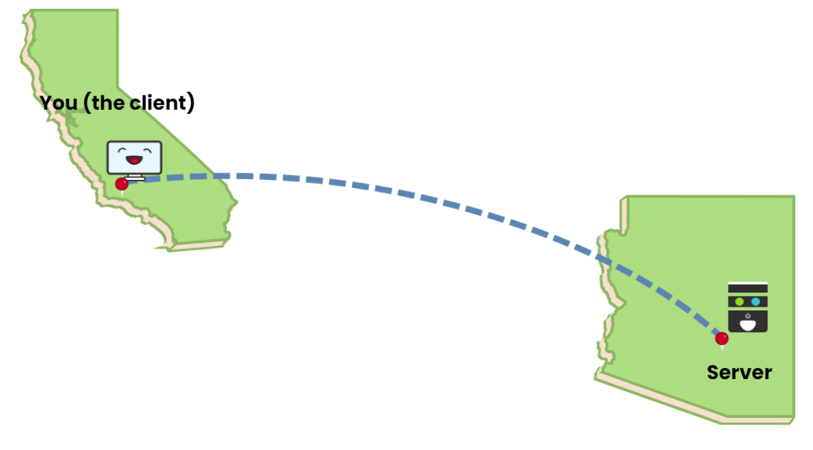
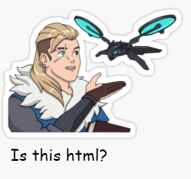
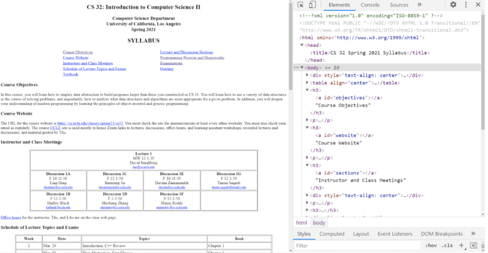
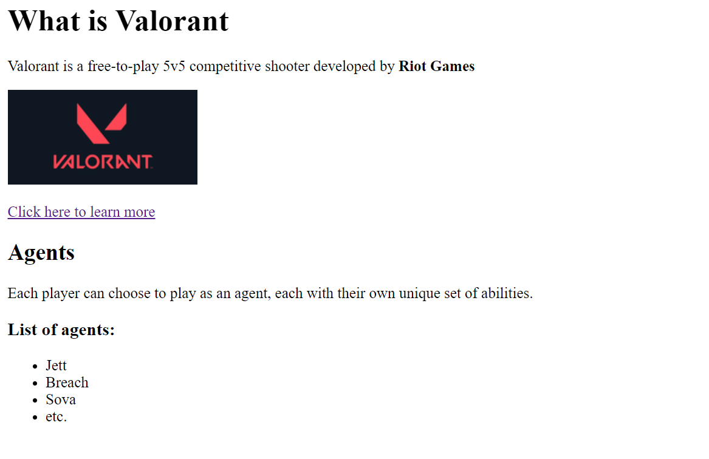
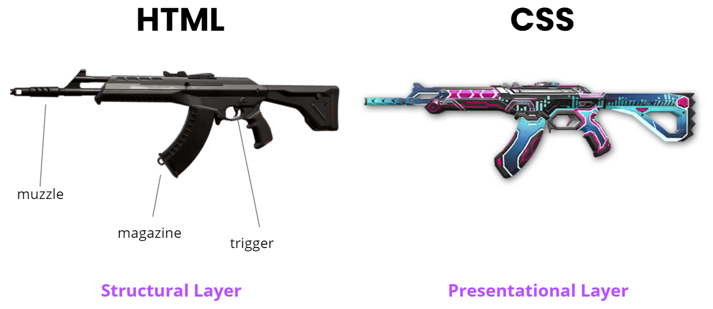
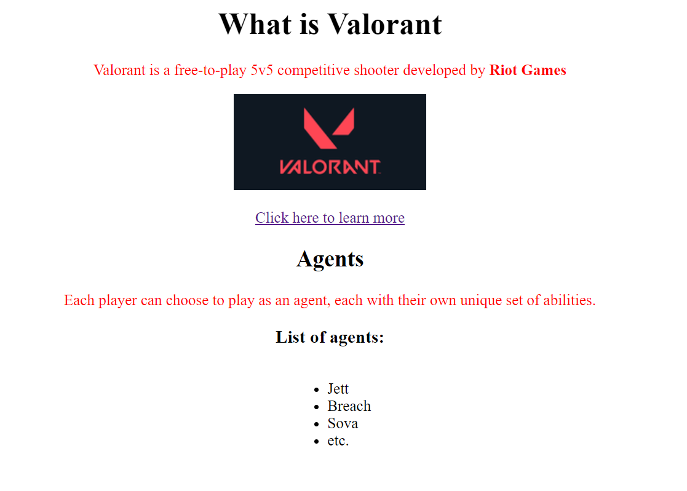

# learn<span>.</span>py Session 6: Web Development with Django

**Date**: May 12, 2021

**Location**: Zoom

**Teachers**: [Alex Xia](https://github.com/khxia), [Eric Yang](https://github.com/eric8yang)

## Resources

- [Slides](https://docs.google.com/presentation/d/1s6wGAEY1QgEpCxD-nfCVepwHw3ZvgRHc80DslN32Sn8/edit?usp=sharing)
- [ACM Membership Attendance Portal](https://members.uclaacm.com/login)

## What we'll be learning today
- [Intro to Web Development](#intro-to-web-development)
- [HTML](#what-is-html)
- [CSS](#what-is-css)
- [Django](#django)


> Note: This workshop series is designed with the assumption that attendees have taken CS31/PIC10A, or any of its equivalents. While we will go through the basics of Python, we do not explain all the details and fundamentals. Rather, we are showing how to do what you have previously done, but within Python.

## Intro to Web Development

Everyday, we use websites and surf the web, but how does the web work?

Let's imagine that we (the client) are surfing the web normally, and we want to go on the website: https://playvalorant.com/en-us. We will then send this request to the server that is located far away from us. The server will them process this request and prepare an `index.html`, `index.css`, `index.js` files (or something similar), and will send it back to us. Our browser (let's say Chrome) will read all the files using these files be able to generate our desired website. 




What we're interested in today, is the server part. We want to be able to write a server that can: 

1. Receive web requests
2. Prepare HTML/CSS/JS files (today we won't be talking about JS much)
3. Send it to the client

And we will be using Django to help us do this (more on this later). 

That being said, we do need to know what HTML and CSS is (the barebones of a website) and how to build websites using them.

## What is HTML?
<p align="center">

</p>

HTML, or Hyper Text Markup Language, is a markup language used when creating webpages. In its essence, HTML is just text with a lot of tags ... I mean a lot. And these tags describe the **structure** and **content** of our page.

Some of these tags are pretty straightforward while others can get quite complex and may need something called **attributes** (we'll see what that is later). 

On Chrome, if you right click any webpage and click 'Inspect Element', you'll see the HTML that Chrome uses to generate the webpage!



### Creating our own HTML page

Let's create an HTML file called `index.html`. 

It looks something like this:

```html
<!DOCTYPE html>
<html>
	<head>
		<title>Valorant</title>
	</head>
	<body>
		<h1>What is Valorant</h1>
		<p>Valorant is a free-to-play 5v5 competitive shooter developed by <b>Riot Games</b></p>
		
        <p><a href="https://playvalorant.com/en-us">Click here to learn more</a></p>
		<h2>Agents</h2>
        <p>
            Each player can choose to play as an agent, 
            each with their own unique set of abilities.
        </p>
        <h3>List of agents:</h3>
        <ul>
            <li>Jett</li> 
            <li>Breach</li>
            <li>Sova</li>
            <li>etc.</li>
        </ul>
	</body>
</html>
```
A few important things to take note of:

* `<!DOCTYPE html>` tag tells the browser that this will be an HTML when it parses our `index.html`. All HTML files need to include this at the top of the file.
* `<html>` and `</html>` tags are placed around our HTML content. This will enclose all of our code in the file.
* `<head>` and `</head>` tags contain information that is not typically displayed in the browser. In this tag, we will typically set the `title` of our page, link our CSS code (more on this later), and import other necessary files (eg. fonts). 
* `<title>` and `</title>` tags include the title of our page, which will be displayed on the webpage toolbar and on search-engine results. 
* `<body>` and `</body>` tag encloses all of the HTML that will actually be displayed on the web browser.
* `<p>` and `</p>` is the paragraph tag. All the text that it encloses will be displayed on a separate paragraph.
* `<h1>` and `</h1>` tags is the header tag of size 1, the largest size. Header tags are typically used for titles and subtitiles. Similarly, `<h2>` and `<h3>` is for sizes 2 and 3 (6 in total).
* `` is a bit of a special tag because we can use it to display images. The way that it does is through an **attribute** called `src`, in this attribute, we specify a link to the image that we want to display.
  * **Attributes** provide additional information about the HTML element; they are always specified in the *start tag*, and usually come in name/value pairs eg. (name="value"). 
* `<ul>` and `</ul>`, as well as `<li>` and `</li>`, stand for unordered list and list item. As you may have guessed, they are used to create bullet points in our webpage.
* `<a href="some_link">` and `</a>` tags encloses the word or phrase that will lead to another link if clicked on. This tag can also wrap around other tags like paragraphs, headers, and even images. `href` is the attribute that specifies the URL that the tag links to.

When we open this file, we see that our webpage looks something like this:



## What is CSS?

> Problem: Our website has content and structure, but it looks kinda ugly.

<p align="center">

</p>

To solve this problem, we need to use CSS. 

CSS stands for Cascading Style Sheets, it allows us to style our webpages, such as changing font size/color, or changing the layout of our page. 

<p align="center">

</p>

People often think of **HTML** as the *structural layer*; it defines the structure and content of the webpage, which dictates what kind of information our website will contain. On the other hand, **CSS** is often though of as the *presentational layer*, where we essentially make our website look prettier and improve its aesthetics, without making an changes to its core structure and functionality.

### Creating our own CSS page

In the same directory as `index.html` is located, create a file called `style.css`. 

```css
body {
    text-align: center;
}

ul {
    display: inline-block;
    text-align: center;
    height: 900px;
}

h1 {
    font-size: 200%;
    font-weight: bold;
}

li {
    text-align: left;
}

p {
    color: red;
}
```
* Our first block of code begins with the selector `body`, which means everything inside the braces will apply to what we put between the body tags in our HTML file.
  * `text-align` will help align our text. Here, we tell it to center all our fonts, but other valid types of alignmnets we can use include `right` and `left`.
* The second block of code begins with the selector `ul`, which means everything inside the braces will apply to our unordered list.
  * The display of `inline-block` places the element on the same line as the adjacent content, but the element behaves as a block element
* The third block of code begins with the selector `h1`, which means everything inside the braces will apply to our header.
  * The `font-size` determines the font size, here, we make it 2 times bigger than the default size.
  * The `font-weight` allows us to create lighter or bolder forms of the content.
* The fourth block of code begins with the `li` selector, which means everything inside the braces will apply to all of our list items.
  * Here, we `text-align` our list item text to the left. This overrites the `text-align: center;` inside the `ul` selector block. Since we specified the `ul` as a block in the center, we can center all `li` items to align to the left of the block. This method of overriting styles as we go deeper into the tag hierarchy is why CSS is called *Cascading Style Sheets*.
* The fifth block of code begins with the `p` selector, which means everything inside the braces will apply to all paragraph tags.
  * The `color` property allows us to change the color of the text inside the property. Here, we change it to `red`. Instead of `red`, you can specify any color or any [RGB hex code](https://htmlcolorcodes.com/).

Great! Now we have the CSS file. But what's the point if our HTML file doesn't use it?

To link the HTML and CSS file, add this inside the `head` tag in `index.html`.

```html
<link rel="stylesheet" href="style.css" />
```
As it's name implies, this tag will link our `style.css` file to the HTML file so that it knows where to bring in the styling from, as such `href` should be a familiar attribute from the `<a>` tag. `rel` is another attribute that tells HTML what the **rel**ationship it has with the linked file.

Try opening `index.html` now! It should look something like this:



### What next?

This is great! We have created a webpage! The problem now is that we can only load this webpage locally from our computer. If other people around the world want to use our website, we have to be able to send them the `.html` and `.css` files somehow. 

How do we achieve this? Through email? Discord? No. That would be very inefficient. Instead, one of the methods that is quite popular is Django. 

## Django
Django is a web framework for Python. What this means is that it essentially allows you to create a web application with the combination of HTML/CSS and Python files. One reason we choose to use Django is that it handles displaying more than 1 page of an website. Specifically, Django also serves as the "server" for you to try and send requests to. Since Django is all we need to begin turning our HTML/CSS into a working web application, we treat it as a "one-stop shop" for everything we need.

### Set-up
In order to begin working with Django, you first have to install Django using Terminal and running either `pip3 install django` (Mac) or `pip install django` (Windows). To check that the installation happened properly, you can run `python3 -m django --version` (Mac) or `python -m django --version` (Windows) to see if there is indeed an updated version of Django installed.

### Creating/running a project
To create and run a Django project, we will once again be running some lines in terminal. In order to create a project called "mysite", you can run the line `django-admin startproject mysite`. After the installation, you can navigate into the project and run `python3 manage.py runserver` (Mac) or `python manage.py runserver` (Windows). If everything worked properly, you should end up with a few messages about your server starting up. One of the lines you will see is `Starting development server at http://127.0.0.1:8000/`. While this may look confusing at first, you can break down this URL into 2 parts. First, the 127.0.0.1 part is a IP address that refers to your localhost. This may be familiar if you've had experience working with other development servers. If not, all this means is that the server you are developing on is hosted on your local computer. The second part is 8000, which just explains which port the server is running on. To see your current page, just direct your browser to [http://localhost:8000/](http://localhost:8000/). Since none of your files are in the project yet, you should just see a default Django page.

### Displaying your own files
In your project, you will see another folder with the same name as your project (I know, confusing). To differentiate between the two, I'll refer to the outermost folder as 'the project' and the inner folder as the `valorant` directory (in your case substitue "valorant" with whatever you named your project). Let's start by creating a folder in the project. We're going to name this `templates` and it'll hold all of our HTML files. Add the HTML files that you created for the previous half of the workshop to this folder and name it `index.html`.

We know that pages are displayed when servers return files for a given request. To handle requests that come in, create a file named `views.py` in the `valorant` directory
```py
from django.shortcuts import render

def home_page(request):
    return render(request, 'index.html')
```

In this code we are using the render function from the Django module to render index.html whenever the `home_page` function is called. However, you'll notice that the exact path to `index.html ` is not defined. The reason for this is that we can actually tell Django where to find your files. 

Within the `settings.py` file, you'll see a `TEMPLATES` variable with a `DIRS` key. Change that line to the following:
```py
'DIRS': [os.path.join(BASE_DIR,'templates')],
```
You'll see here that we're making use of something called `os`. os is actually a module that helps simplify the definition of file locations. To use it though, we'll need to add the line
```py
import os
```
to the top of our `settings.py` file. Feel free to explore os more on your own, but just know that what this function does is join the location specified by `BASE_DIR` (a variable a bit higher up in `settings.py`) with templates. `BASE_DIR` actually holds the path to your project, and `templates` is the name of your folder where HTML files are found. Thus, the combination of the two gives the entire path to your templates folder. 

Next up, we have to handle the process from the URL being requested and the expected files being rendered. We've defined the function `home_page` to render the `index.html` file, but we haven't yet defined when the `home_page` function will be called. In `urls.py`, you'll see that `urlpatterns` currently has 1 path defined. Let's create another one by adding `path('', views.home_page),` right below `path('admin/', admin.site.urls),` in the list. Doing so specifies that in the case that there is no extension after the URL (in order words, just `localhost:8000`), we are going to call the `home_page` function from views. However, we also need to make sure to import `views.py` so we can use its functions. To do this, we simply add the line `from . import views` to the top of the file. All this means is that we are importing the view module from . (which refers to the current directory).

Now if you try reloading your `localhost:8000` page, you should see the `index.html` file that you defined previously. However, one thing you may notice is that all of your styling is not there anymore. Similar to the situation we had with `index.html`, we need to tell Django where to look for the CSS files.

Let's first create the directory for our CSS files. We'll being by creating a folder named `static` in the project, and this folder will serve the purpose of holding all of our static files like CSS, images, etc. Within that `static` folder, we're going to create a new folder named `css`, which as the name suggests, will contain only CSS files. Copy the CSS file you made for the first half of the workshop here and rename it to `style.css`.

Moving to the `settings.py` file again, we're going to add a new tuple with the path to our `static` folder to the bottom of the file. It should look something like:
```py
STATICFILES_DIRS = (
    os.path.join(BASE_DIR, 'static'),
)
```
Now that we've got the static file set up, we also need to change some of the linking in the HTML files. You can edit your `index.html` file's link tag to:
```HTML
<link rel="stylesheet" href="static/css/style.css"/>
```
After completing these steps, your page should now show up with styling!

### Handling multiple pages
In order to serve multiple pages based on the URL, you follow similar steps that we went over for the `index.html` page. For example, let's say I created a file named `jett.html`. I would first make a function in `views.py` that looks something like:
```py
def jett(request):
    return render(request, 'jett.html')
```
This function will render the `jett.html` page when called. Then in `urls.py`, I can add the line
```py
path('jett/', views.jett),
```
to call the jett function when /jett/ is appended to the URL of `localhost:8000`. We can continue doing this for further files we want to display.
