# learn<span>.</span>py Session 7: Web Developement 2 <!-- omit in toc -->

**Date**: May 19, 2021

**Location**: Zoom

**Teachers**: [Timothy Rediehs](https://github.com/timthetic), [Jody Lin](https://github.com/jodymlin)

## Resources <!-- omit in toc -->

- [Slides](http://links.uclaacm.com/learnpy21-s7-slides)
- [ACM Membership Attendance Portal](https://members.uclaacm.com/login)

## What we'll be learning today <!-- omit in toc -->
- [Recap: Django](#recap-django)
- [Django Project Struture](#django-project-structure)
- [Django Templates](#django-templates)
- [A Quick Intro to Databases](#a-quick-intro-to-databases)
  - [About Models](#about-models)
  - [Migrations](#migrations)
- [Demo: Databases](#demo-databases)

## Recap: Django
In our last session of **learn.py** we learned how
Django can be used as web development framework. We
learned how to set up a basic Django project and
how to serve web pages from it. 

If you haven't already checkout out [last week's 
workshop](https://github.com/uclaacm/learn.py-s21/tree/main/session-6-web-development-1), make sure you
either watch the [recording](https://youtu.be/J1Fzz4TePGY) or go through the README. This workshop
will be building off of the most knowledge from 
last week.  

## Django Project Structure

In this workshop we are going to build a project that simulates
what it is like to walk down Bruinwalk during non-pandemic times. 
But before we begin, we need to first understand how Django
projects are structured. 

### Projects + Apps
Django projects are often broken into _apps_. The
usage of the word _app_ is not the one we're typically used to. 
This is not a full app like a full web or mobile application. 
**Django apps are isolated components of a full project**. 

Apps within a project will usually have their own associated
data models and functionality. They will handle _one_ part
of the overall project logic and nothing else. 

Let's take a look at an example: Let's say we have a project
called _UCLA_. This keeps track of all the affairs for UCLA. 
Some important parts we'd like to keep track of: 
* housing: dorming and dining ~~some please swipe me in thanks~~
* classes: student enrollment
* sports: football, gynmastics, basketball, etc.
* clubs: academic and social club affairs

Within our Django project, we would probably break down our
project into the following apps:
* housing - app handles dorming and dining issues
* classes - app handles class enrollment
* sports - app tracks sports statistics 
* clubs - app tracks active clubs and their activities

Each of these apps will operate independently of the other and 
together, will form the entire _UCLA_ project. 

## Demo: Let's make a Bruinwalk app!

In this workshop we're going to build a Bruinwalk app
that provides a snippet of what its like to ~~be bombarded
with people flyering when you~~ walk up Bruinwalk. For
those who've never been to campus, this is what it looks
like: 


Our project will be called **bruinwalk** and will have
1 app called **flyer**. This app is responsible
for managing the people flyering and will track 
their success ~~of annoying people~~ by tracking
how many flyers they've handed out. 

Before we continue, here is a summary of what our app will do: 

**Summary**\
This app will have 2 types pages that we will interact with:
1. A page that lists all the people flyering on bruinwalk.
1. An information page for each person flyering. This will hold 
extra details that show how many fylers they've handed out. 
   * On an information page, we should be able to click a button that
  let's us take a flyer from each person. 

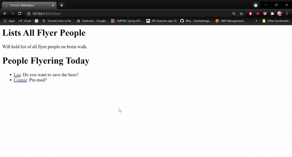

### Demo: Project Setup
Navigate to your folder of choice and type the command below in your
terminal to create a Django project. 
```bsh
django-admin startproject bruinwalk
```

Open any code editor of your choice (I'm a VSCode stan) and verify
that your `bruinwalk` project folder contains another folder called 
`bruinwalk` and a `manage.py` file. This is the root of our project
and we will be typing all of our project commands from here. 

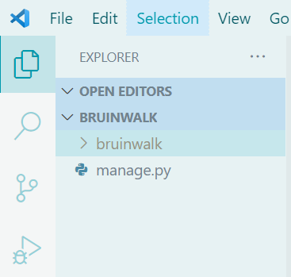

You can verify that your project is working by starting the 
development server with the commands
```
python manage.py runserver
```
> Note: These commands are for a Windows device. If you are on MacOS,
> swap out `python` for `python3` to run the equivalent command. This
> applies to all commands that begin with `python` in this demo.  

If all works, you'll see a url you can navigate to to see the 
project running. Click _Ctrl+C_ on Windows or _Cmd+C_ on MacOS
to stop running the server. 

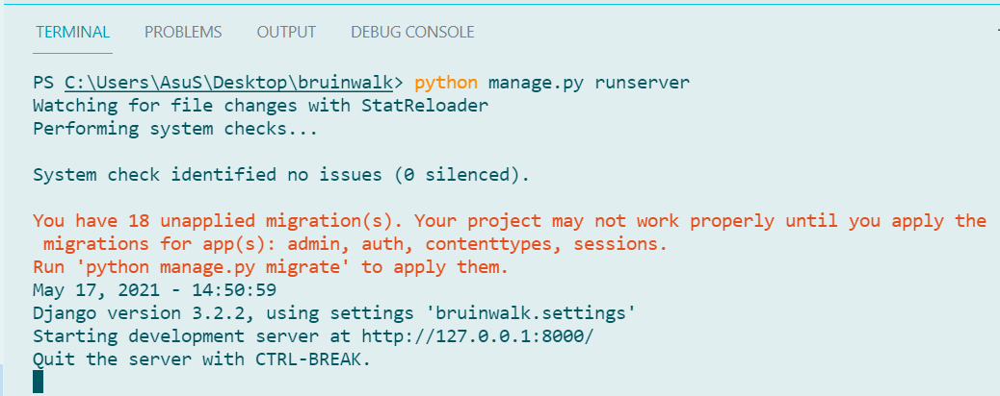


## Demo: Creating our initial app
Next we're going to add the **flyer** app to our project. Type
the command below:
```
python manage.py startapp flyer
```
This will create a new folder in our project called `flyer`. This
folder will hold all the code needed for our **flyer** app. 
> After this demo, feel free to create more apps within this project
> to apply your knowledge and practice using Django!

Within the `flyer` folder, create a folder called `templates` and
the following files. 

**`index.html`** 
```html
<!DOCTYPE html>
<html>
  <body>
    <h1>List of all Flyer People</h1>
    <p>Will hold list of all flyer people on bruin walk.</p>
  </body>
</html>
```

**`flyer_info.html`**
```html
<!DOCTYPE html>
<html>
  <body>
    <h1>Flyer Person Info</h1>
    <p>Information about flyer person.</p>
  </body>
</html>
```

Your project files should look like this: 
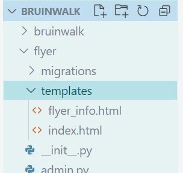

Next we must create views for each of these pages. Under the
`flyer` folder, add the following functions to `views.py`:
```py
from django.shortcuts import render

# Create your views here.
def index(request):
  return render(request, 'index.html')

def flyer_info(request):
  return render(request, 'flyer_info.html')
```

Next we must create the url endpoints to access these views.
Inside the `flyer` folder, create a new file called `urls.py` 
and add the following code:

**`urls.py`** (under the `flyer` folder)
```py
from django.urls import path
from . import views

app_name='flyer'
urlpatterns = [
    path('', views.index, name='index'),
    path('info/', views.flyer_info, name='flyer_info'),
]
```
Let's break down this file. 

By using the `path` function, we are creating endpoints from
which we can access the views we just defined. In return, these
views will return the html files we created earlier. An empty
endpoint should will return `index.html` and the `info/` endpoint
will return `flyer_info.html`. 

The `name` parameter we passed names these paths for Django. Similiar
to how programmers can refer to data by storing them in named data,
we can name later refer to these paths with the names we've passed
in via this paramater. 

The line `app_name='flyer'` is also a line that let's Django know
that these url patterns belong to the `flyer` app. To refer to 
any one of the paths we defined, we'd use this app name and 
the path names we defined. For our app, this would be 
`flyer:index` or `flyer:flyer_info`. We'll show how this is used later.

If we run our project right now, we'll still get an error when
we try access the endpoints. The empty path will show the default
Django app and if we try access the `info/` endpoint we'll
get an error.

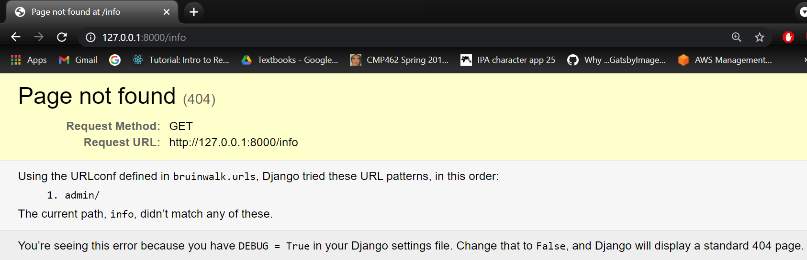

We'll need to do 2 things to fix this:
1. We have to register our `flyer` app under our project. 
1. We have to create an endpoint to access the `flyer` app's url paths we defined. 

First we'll register the `flyer` app. What does this mean? This means
that we are letting Django know we are connecting one of the apps
we created to our project. Although this seems inconvenient, this
makes apps extremely resuable. This means we can even reuse apps
across different projects by connecting them (registering them) to 
different projects. 

To do this, go to `settings.py` under the `bruinwalk` folder. Find
the line that defines the `INSTALLED_APPS` list and register app
as follows:
```py
INSTALLED_APPS = [
    'flyer.apps.FlyerConfig', # REGISTER FLYER APP HERE
    'django.contrib.admin',
    'django.contrib.auth',
    'django.contrib.contenttypes',
    'django.contrib.sessions',
    'django.contrib.messages',
    'django.contrib.staticfiles',
]
```
What did this do? Under the file `./flyer/apps` we can find a class
called `FlyerConfig`. This class defines our `flyer` app. The
path `flyer.apps.FlyerConfig` corresponds to the path to import
this class. Adding this line tells Django that we are using this
app in the project. 

Next we'll add an enpoint called `flyer/` from which we can 
access the `flyer` app. Our pages will be accessible from endpoints
like `flyer/` (returns the `index.html` page) and `flyer/info` (gives
the `flyer_info.html` page).

Under the `bruinwalk` folder, find the file called `urls.py` and
modify to match the following. 

**`urls.py`**
```py
from django.contrib import admin
from django.urls import path, include # new 'include' import

urlpatterns = [
    path('admin/', admin.site.urls),
    path('flyer/', include('flyer.urls')), # new code added
]
```
Let's break down what we just did.

We created a new endpoint called `flyer` that will host our
**flyer** app. This is all made possible by the `include` function. 
What exactly does `include` do though?

### `include()`
[Django docs](https://docs.djangoproject.com/en/3.2/intro/tutorial01/)
say this about include: 
> "The include() function allows referencing other URLconfs. Whenever 
> Django encounters include(), it chops off whatever part of the URL 
> matched up to that point and sends the remaining string to the 
> included URLconf for further processing."

What this means is that when we something the like endpoint 
`flyer/info`, Django will match `flyer/` path, chop off the string
`flyer` and send the rest of the string (`info/`) to the `urls.py`
file that we defined under the `flyer` app folder. From there `info` 
will match the url path pattern we defined to return the
`flyer_info.html` page.

### Checkpoint: Accessing our app
**Finally** if we run our project, we should be able to access
our **flyer** application via the endpoints `flyer/` and 
`flyer/info`.

Before we move on to the next section, we're going to tweak
one part of our app. Currently we access `flyer_info.html` via
the endpoint `flyer/info`. However, we'll be later creating
multiple `flyer_info.html` pages, one per flyer person. So
we're going to change the endpoint so that we can access
via a number, which we'll call a `flyer_id`. 

Change `flyer/urls.py` and `flyer/views.py` to match the following:

**`urls.py`**
```py
from django.urls import path
from . import views

app_name='flyer'
urlpatterns = [
    path('', views.index, name='index'),
    path('<int:flyer_id>', views.flyer_info, name='flyer_info'), # modified
]
```

**`views.py`**
```py
from django.shortcuts import render

# Create your views here.
def index(request):
  return render(request, 'index.html')

def flyer_info(request, flyer_id): # added flyer_id parameter
  return render(request, 'flyer_info.html')
```
> If what we just did does not make sense, go back to the previous
> workshop lesson to learn about creating dynamic endpoints with 
> integers.

### Checkpoint
You should be able to access both pages of our app, through
`flyer/` and `flyer/123`. (Note: `123` could be any integer.)

## Django Templates
We could start coding HTML files for each of our pages, but we'll
run into a minor inconvenience: we have to hard code all the 
information we want in the page directly in the HTML. 

What do I mean by hard coding? Take last week's workshop demo. We
coded a page in html and accessed it via Django. Mine looked
like this: 


This was accessed via the url `http://127.0.0.1:8000/eric`.

However, let's I wanted to create an identical page about my
other friend Alex. This would look like this:

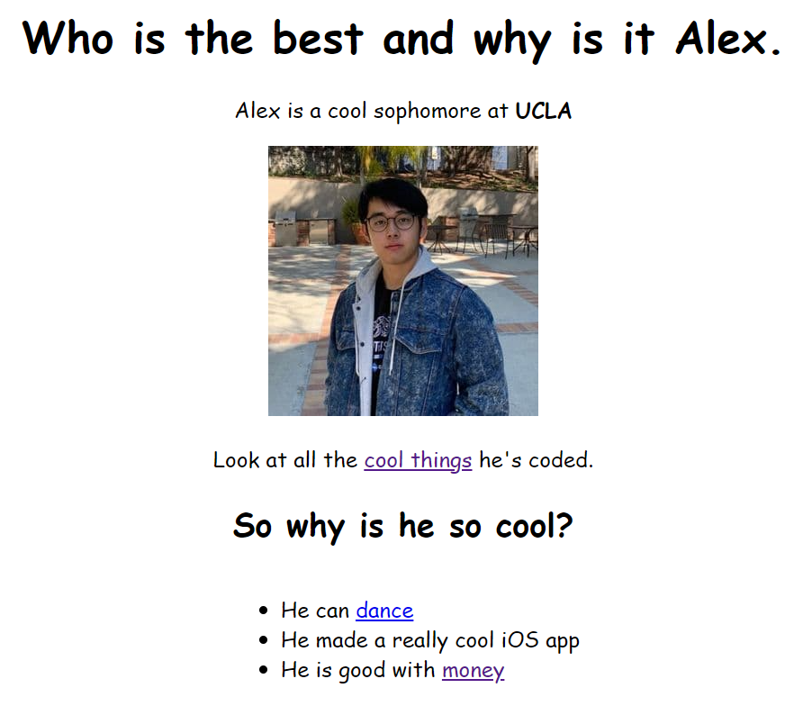

This would be accessed via `http://127.0.0.1:8000/alex`. 

Ignoring the fact that I'm now being a bad friend by making
both think they're the best, we can see that these pages are 
nearly identical except for these few areas:

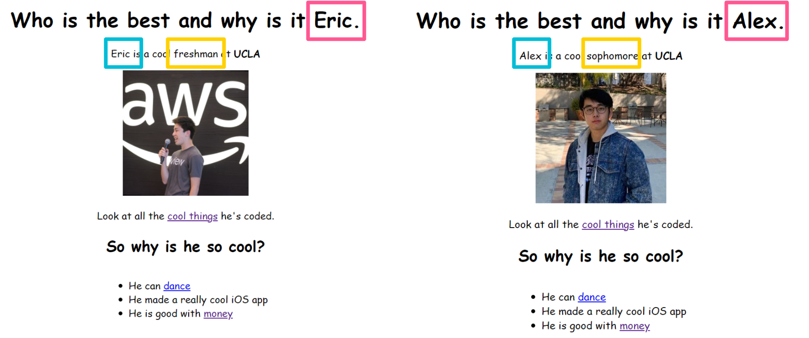

We _could_ hard code each of these pages, however we'd mostly
be copy-pasting most of the content. 

**Wouldn't it be convenient if we could find a way to _dynamically_
build HTML pages instead?**

This way we could just pass in the main information about each
person and reuse a single HTML file. 

We _could_ use JavaScript, but then also we remember that this
is valid JavaScript:

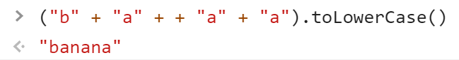


So instead of asking ourselves "How do we code JavScript?"
we ask the better question "How do we ~~code~~ **avoid** 
JavaScript?"

### Templates (aka how to avoid JavaScript)
Django templates gives us a way to use generate HTML files
based off of variables, if conditions, loops, and other 
conditions. 

It looks like this:
```html
<h1>My name is {{ name }}</h1>
```
When `name` is given the value `Jody`, the rendered HTML
will have an `<h1>` tag that reads **"My name is Jody"**. 
(The value "Jody" will have complete replaced `{{ name }}`).

Let's look at how templates work before using it in our project:

### Templates: Variables
To use a variable in Django templates, simply wrap the variable
in `{{ }}`. 

Here are a few examples:
```html
<h1>{{ my_title_owo }}</h1>

<p>UCLA was founded in {{ founded_year }}</p>
```

The value of the variable will completely replace the 
`{{ variable_name }}` in the code. 

### Templates: Tags
Tags are special templating code that will behave like
regular python code. 

For example we could define an if tag that will 
conditionally render some html. 
```html

  <p>quick mafs</p>

  <p>regular mafs?</p>

  <p>slow maths?</p>

```
Notice how the if statement is wrapped in `` and how
there is a _closing tag_ ``, which indicates
that this is the end of the if block. This is all part 
of the templating tag syntax defined by Django. 

Some useful tags also include a for-loop:
```html

	<p>{{ num }}</p>

```
> Also pay notice to the closing `'

And also a url tag that lets us dynamically assemble
urls. 
```html
<a href=">">link</a>
```

Here `some-url-name` can be replaced with any url. _arg1_ and 
_arg2_ will be appended as endpoints so we'd end up with
something like `some-url-name/arg1/arg2`. 

### Templates: Comments
Django templating also comes with comments. These look like this:
```html
{# this is a single line comment #}


This will not be rendered in the HTML

```

### Templates: Context
By this point you've probably been thinking _"Where on earth
are all of these template variables being defined?"_ In our
previous example
```html
<h1>{{ my_title_owo }}</h1>
```
where are we defining `my_title_owo`?

The answer is something called **context**. Let's head back
to `views.py`, where we render the html files. 

```py
# views.py 
from django.shortcuts import render

# Create your views here.
def index(request):
  return render(request, 'index.html')

def flyer_info(request, flyer_id):
  return render(request, 'flyer_info.html')
```

The `render()` function actually takes in a 3rd parameter
that let's us pass in the context. If we wanted to pass
in variables to `index.html`, we'd pass them into the file
via a dictionary, like this:

```py
def index(request):
  context = {
    'name': 'narnar',
    'pitch': 'come haccc with us',
    'age': 18,
  }
  return render(request, 'index.html', context)
```

Then in `index.html` we can access the context variables 
as such.
```html
<!DOCTYPE html>
<html>
  <body>
    <h1>Lists All Flyer People</h1>
    <p>Will hold list of all flyer people on bruin walk.</p>
    <h2>{{ name }}, Age: {{ age }}</h2>
    <p>{{ pitch }}</p>
  </body>
</html>
```

Let's say we wanted to pass in a list of people flyering
today. We could use a for loop to list out all these people.
```py
# in views.py
def index(request):
  context = {
    'name': 'narnar',
    'pitch': 'come haccc with us',
    'age': 18,
    'flyer_people': ['tim', 'jody', 'andre'] # NEW
  }
  return render(request, 'index.html', context)
```
```html
# index.html
<!DOCTYPE html>
<html>
  <body>
    <h1>List of all Flyer People</h1>
    <p>Will hold list of all flyer people on bruin walk.</p>
    
    <h1>People Flyering Today</h1>
    
      <li>{{ person }}: {{ pitch }}</li>
    
    </ul>
  </body>
</html>
```

We could also modify this to check if the list of `flyer_people`
is empty. If the list is empty, we'll just print out the
default message "Thank god."

```html
# index.html
<!DOCTYPE html>
<html>
  <body>
    <h1>List of all Flyer People</h1>
    <p>Will hold list of all flyer people on bruin walk.</p>
    
    <h1>People Flyering Today</h1>
    
    <ul>
    
      <li>{{ person }}: {{ pitch }}</li>
    
    
    <p>Thank god.</p>
    
    </ul>
  </body>
</html>
```

We can also make use of the **url** tag mentioned earlier. 
Let's link each person to a flyer page. For now, we only
have one `flyer_info.html` page, so we'll just link to this. 
However, later we'll customize `flyer_info.html` to hold
specific information about a flyer person. 

On the line
```html
<li>{{ person }}: {{ pitch }}</li>
```
we'll modify it to this:
```html
 <li><a href="">{{ person }}</a>: {{ pitch }}</li>
```
Let's break down this use of the **url** tag. 

`flyer:flyer_info` references the path we defined in 
`flyer/urls.py`. In this file, we named the path that
returns the `flyer_info` view _flyer\_info_. This effectively
translates to "in the _flyer_ app, find the path we defined
called _flyer\_info_ and use the url with this endpoint."

Next we list the integer argument `1`. This argument
is passed to the url path. 

What will come out of this **url** tag is a url that looks
something like this
```
http://127.0.0.1:8000/flyer/1
```
> Note: http://127.0.0.1:8000 might be different on your machine.
> However, the endpoints will be the same. 

Now each listed name should link to the `flyer_info` page. 

### Checkpoint: templated `index.html`
Your index page should now render like this:

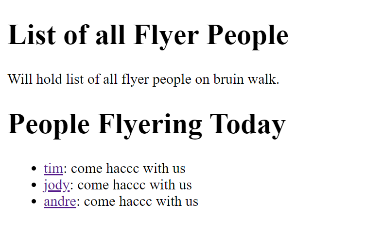

We can use templating and use templating to build the
`flyer_info.html` page as well. 

The completed code will look like this:
```py
# views.py
from django.shortcuts import render

# Create your views here.
def index(request):
  context = {
    'name': 'narnar',
    'pitch': 'come haccc with us',
    'age': 18,
    'flyer_people': ['tim', 'jody', 'andre']
  }
  return render(request, "index.html", context)

def flyer_info(request, flyer_id):
  context = {
    'name': 'Jody',
    'pitch': 'Do you want to save the bees?',
    'flyers_given': 0
  }
  return render(request, "flyer_info.html", context)
```

```html
# flyer_info.html
<!DOCTYPE html>
<html>
  <body>
    <h1>Flyer Person Stats</h1>
    <p>Information about flyer person</p>
    
    <h2>{{ name }}</h2>
    <p>{{ pitch }}</p>
    <p>Flyers given: {{ flyers_given }}</p>
  </body>
</html>
```

### Checkpoint: templated `flyer_info.html`
Your `flyer_info` view should now be rendered as such:

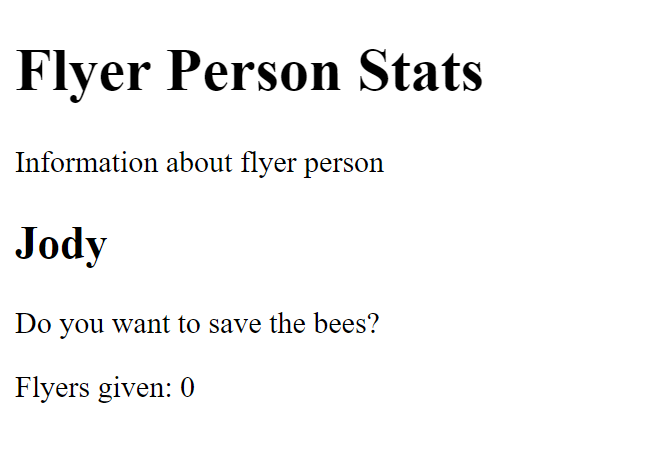

## A Quick Intro to Databases
We use databases to store information our app needs persistently. This means that restarting the server will not cause the data to be lost. Django comes with sqlite, one of many databases, out of the box along with an easy to use interface for it. You can think of sqlite as a big collection of tables (kind of like and Excel sheet, but way better).

### About Models
Django provides us with a special `models.Model` object that helps us interact with our database. We can create new tables by making a new subclass of `models.Model` and modify the structure of those tables by modifying our subclasses. Another benefit of models is that we don't have to know any SQL! Instead of saying `SELECT * FROM fruit`, we could say something like `Fruit.objects.all()` and get our response in a convenient Python list.

### Migrations
There are two important commands for when we create or modify our database models:
```py
python manage.py makemigrations flyer
python manage.py migrate
```
These commands will look at your models and create the appropriate database migrations to synchronize your database with your models (the second command executes those migrations). These migrations allow you to keep track of changes to your database as well as safely make changes without having to worry too much about losing all your data. This is a big deal for applications that are being used in production.

## Demo: Databases
The first thing we'll do is create a database model in flyer/models.py. Edit that file so it looks like this:

```py
from django.db import models

# Create your models here.
class FlyerPerson(models.Model):
    name = models.CharField(max_length=100)
    pitch = models.CharField(max_length=300)
    flyers_given = models.IntegerField()
```

We inherit from the `models.Model` class because our `FlyerPerson` needs to be a database object with all of the functionality to interact with the database. We can add any fields we want and give them one of several types. Here is a list of some useful ones:

* Boolean: `models.BooleanField()`
* Date/time: `models.DateTimeField()`
* Float: `models.FloatField()`
* Number: `models.IntegerField()`
* Text: `models.CharField(max_length=N)` or `models.TextField()`

Django comes with some useful admin tools that we can use to see our database tables, but we need to create a superuser to use them. We can do this with two commands.

```
python manage.py migrate
python manage.py createsuperuser
```

`python manage.py migrate` will create some necessary tables for our superuser. Then `python manage.py createsuperuser` will create our superuser. Follow the prompts to create the superuser.

Next, try running the server with `python manage.py runserver` and navigating to localhost:8000/admin. Enter the username and password of your superuser, then you should see a screen like this: 

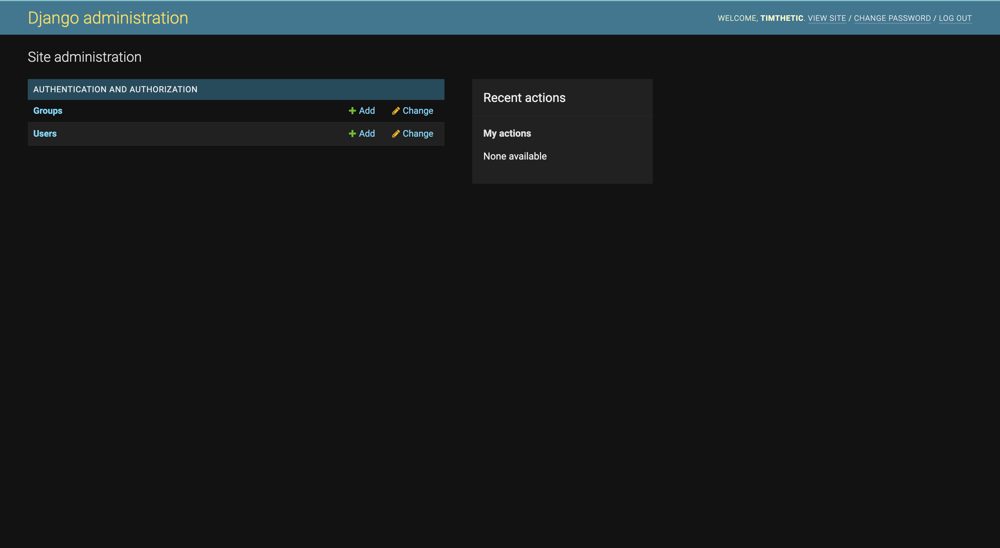

We should be able to see our tables here, but oh no! Our tables are nowhere to be found. This is because we did not create and run the migration for our new table (we only ran the migrations for some of Django's bookkeeping tables). Let's do that now.

```
python manage.py makemigrations flyer
python manage.py migrate
```

These commands will create the migrations for our models in our flyer app, then run them. Now, if we start our server with `python manage.py runserver` again, `localhost:8000/admin` should show our table, right? Not yet. It turns our that our admin page doesn't know our model exists. We have to tell it by modifying flyer/admin.py to look like the following:

```py
from django.contrib import admin
from . import models
# Register your models here.
admin.site.register(models.FlyerPerson)
```

Now our model should show up:
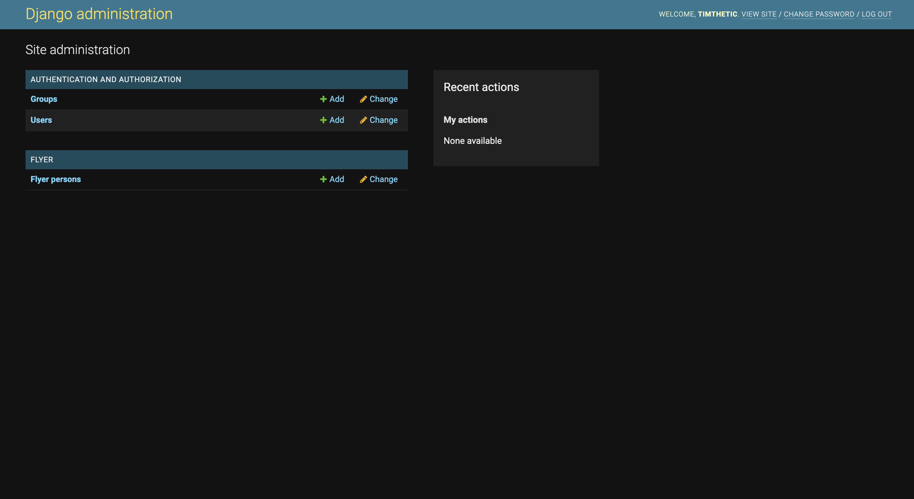

If you click on the add button with a green plus, it should bring you to a page that let's you create new Flyer People in the database. Add two Flyer People. You should see them in the Flyer Persons section of the admin page.

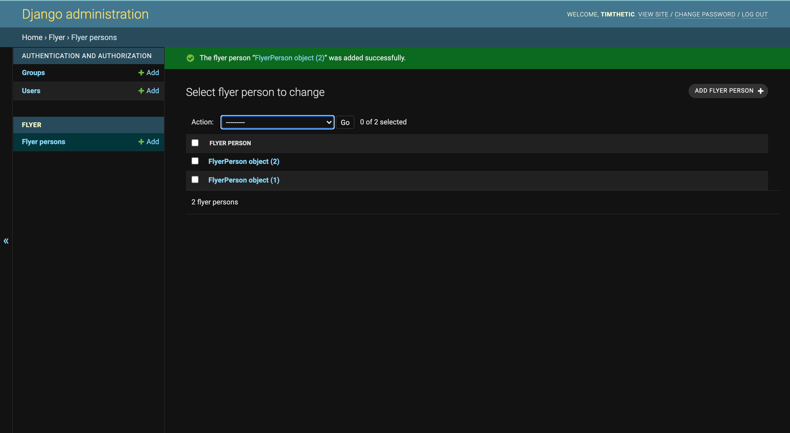

Next, we want to rewrite our views and templates to use our new models. First, let's modify flyer/views.py. We'll need to import our model using `from .models import FlyerPerson`. Then, we can rewrite the `index` function as follows:

```py
def index(request):
  flyer_people = FlyerPerson.objects.all()
  context = {
    'flyer_people': flyer_people
  }
  return render(request, "index.html", context)
```
It's very similar to what we had before, accept we fill our flyer_people with all the objects in our database using `FlyerPerson.objects.all()`. Let's try running our server and see what happens.

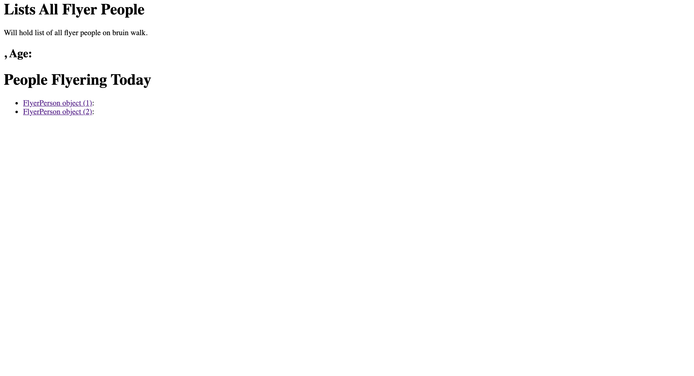

Oh no, what on earth is `FlyerPerson object (1)`? Our flyer people used to be just strings, if we want to display their names, we'll have to change `flyer/templates/index.html` as show below:

```html

<li><a href="">{{ person.name }}</a>: {{ person.pitch }}</li>

```

This should look like the following now:

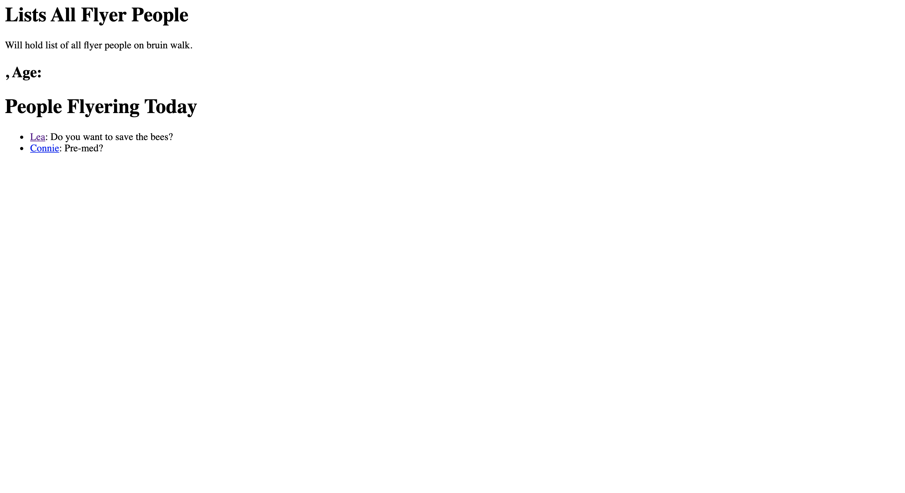

Next, we can modify our `flyer_info` view in a similar way. In `flyer/views.py` modify the `flyer_info` function to the following

```py
def flyer_info(request, flyer_id):
  try:
    person = FlyerPerson.objects.get(id=flyer_id)
  except(FlyerPerson.DoesNotExist):
    raise Http404("Person does not exist")
  context = {
    person: person
  }
  return render(request, "flyer_info.html", context)
```
This is similar to before, but we only get a single Flyer Person with a specific id using `FlyerPerson.objects.get(id=flyer_id)`. Next, we'll need to modify `flyer/templates/flyer_info` to use our new model:

```html
<h1>Flyer Person Stats</h1>
<p>Information about flyer person</p>

<h2>{{ person.name }}</h2>
<p>{{ person.pitch }}</p>
<p>Flyers given: {{ person.flyers_given }}</p>
```

Perfect. Next, we want to add a button on the flyer_info page that lets you take a flyer (increments the flyers_given counter by one). To do this, we can just add an html form to the flyer_info template and a take_flyer view to our flyer/views.py file.

> Note: while our new take_flyer function in in the `views.py` file, it's not really a view as much as a block of code that we can ask to execute from our html form. This will become clearer as the demo progresses.

First, we can add the basics of an html form to the end of the body of `flyer/templates/flyer_info.html`:

```html
<form>
    
    <input type="submit" value="Vote">
</form>
```

This just adds a button to the page that is part of a form. It does nothing else for now. `` is a built in function that helps us prevent [cross-site request forgeries](https://owasp.org/www-community/attacks/csrf). Next, let's build `take_flyer()` in `flyer/views.py`.

```py
from django.http.response import Http404, HttpResponseRedirect
from django.urls.base import reverse
def take_flyer(request, flyer_id):
  try:
    person = FlyerPerson.objects.get(id=flyer_id)
  except(FlyerPerson.DoesNotExist):
    raise Http404("Person does not exist")
  person.flyers_given += 1
  person.save()
  return HttpResponseRedirect(reverse('flyer:flyer_info', args=(person.id,)))
```

This should get the correct Flyer Person, then try to increment their number of flyers given. The last line will redirect the user to our flyer_info page using `person.id` (/flyers/:id). Remember that we named that url "flyer_info" using the name parameter and the `app_name` in `urls.py` is "flyer", hence "flyer:flyer_info".

We also need to add an entry in `urls.py` for this new view:

```py
urlpatterns = [
    path('', views.index, name="index"),
    path('<int:flyer_id>', views.flyer_info, name="flyer_info"),
    path('<int:flyer_id>/take_flyer', views.take_flyer, name="take_flyer") # This line is new
]
```

Finally, we can add an "action" to our html form to submit a request to our new endpoint when the button is clicked. We do that as follows:

```py
<form action="" method="post">
    
    <input type="submit" value="Vote">
</form>
```

This will send a POST request to our new endpoint which will run our code to increment the counter in our model. With that, we've finished our flyer feature.
