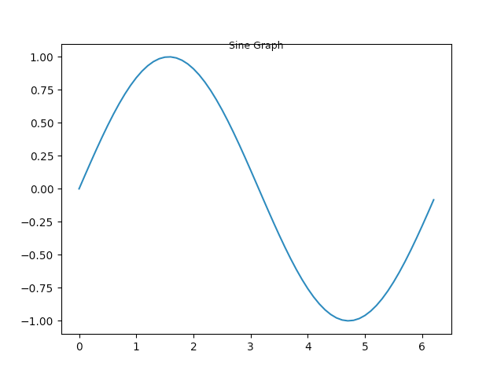
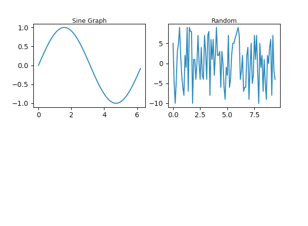
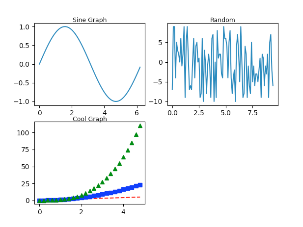
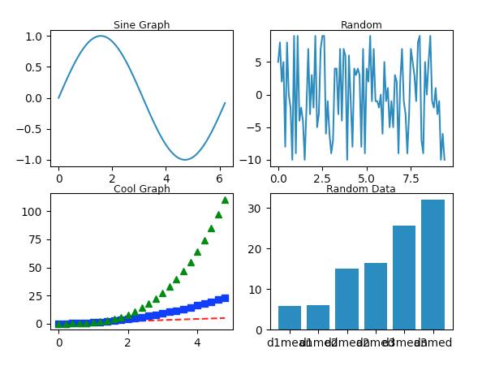
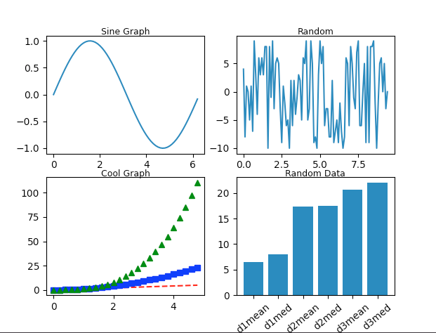
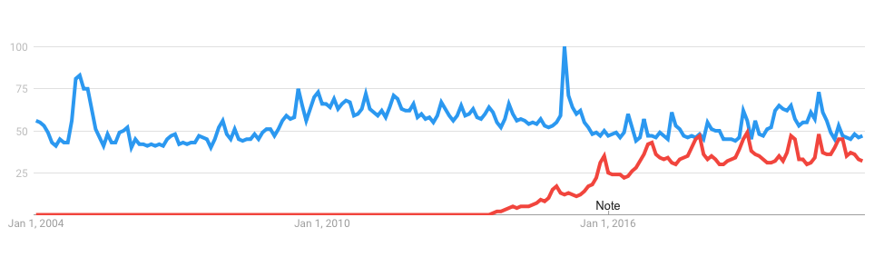
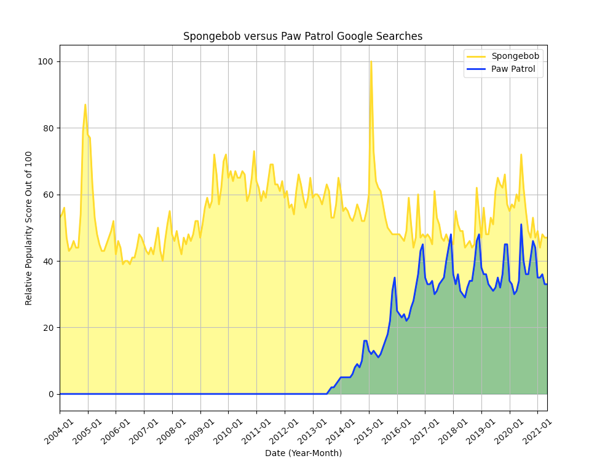

# learn<span>.</span>py Session 8: Standard Library and Packages <!-- omit in toc -->

**Date**: May 26, 2021

**Location**: Zoom

**Teachers**: [Jakob Reinwald](https://github.com/jakobreinwald), [Chandra Suresh](???)

## Resources <!-- omit in toc -->

- [Slides](http://links.uclaacm.com/learnpy21-s8-slides)
- [ACM Membership Attendance Portal](https://members.uclaacm.com/login)

## What we'll be learning today <!-- omit in toc -->
- [A Couple Quick Library Shoutouts](#a-couple-wuick-library-shoutouts)
- [Preview Demo Libraries](#preview-demo-libraries)
- [Demo!](#demo)
- [More Standard Libraries!](#more-standard-libraries)
  - [TensorFlow](#tensorflow)
  - [OpenCV](#opencv)

## A Couple Quick Library Shoutouts
- [Quick Note](#quick-note)
- [os](#os)
- [glob](#glob)
- [timeit](#timeit)
- [Data Structures](#data-structures)


## Quick Note
- The following few slides are meant to be a *very* brief introduction to a few libraries you may find useful
- Within a Python file/interpreter, run the following commands:
  - ```dir(<module>)```
    - Returns a list of all module functions
  - ```help(>module>)
    - Returns an etensive manual page for module


## os
- os provides dozens of functions for interacting with the operating system
  -  Make directory, list directory contents, get current working directory, and more!
-  imported with ```import os```
-  [os docs](https://docs.python.org/3/library/os.html)


## glob
- glob is used to retrieve files and pathnames that match a specific pattern
  - If you are familiar with grep in linux, it is kind of like that
  - It also accepts regex! (woohoo regex)
- imported with ```import glob```
- Example usage:
  - ```glob.glob('something')```
  - ```glob.glob('./[0-9].*')```


## timeit
- If you're interested in checking the performance of your programs or comparing speeds of different commands,
  the timeit library is perfect for you!
- imported with ```import timeit```
- Example usage: 
  ```
  from timeit import Timer
  Timer(`commands to check`).timeit()
  ```
  - This will time and returns the time it took to run the command in the quotes.


## Data Structures
- Remember stacks, queues, heaps, etc. from cs32? We can use those in python too! One of the main benefits of
  using data structures such as deque is that they provide quicker append and pop options than a normal list.
- Examples:
  ```
  from collections import deque
  my_deque = deque(["Mr Krabs", "Gary", "Squidward"])
  ```
  ```
  import heapq
  heapq.heapify(<some list you already have>)
  ```
  The heapify command will rearrange the list you have into a heap order.
  
  
## Preview Demo Libraries
- Alright! Now that we have shown you just a couple of standard libraries you could find useful, lets quickly
  talk about some of the libraries we will be demoing and taking a closer look at!
- [math](#math)
- [random](#random)
- [statistics](#statistics)
- [numpy](#numpy)
- [matplotlib](#matplotlib)


## math
- The math library is used for mathematical operations and constants.
- imported with ```import math```
- [math docs](https://docs.python.org/3/library/math.html)


## random
- The random library is used for generating numbers and other cool random stuff! 
- imported with ```imported random```
- [random docs](https://docs.python.org/3/library/random.html)


## statistics
- The statistics library is used for calculating basic statistical properties of numerical data.
- This one needs to be installed:
  - ```pip3 install statistics```
  - imported with ```import statistics```
- [statistics docs](https://docs.python.org/3/library/statistics.html)


## NumPy
- Numpy, which stands for Numerical Python, consists of more advanced math and logical operations. It's most
  used attributes are its powerful n-dimensional arrays, and various numerical comuting tools.
- imported with ```import numpy as np```
- [numpy docs](https://numpy.org/doc/stable/user/quickstart.html)

- Here's a little more detail about some of the cool stuff in ```numpy```:
  - ndarray
    - "n-dimensional array", each dimension is an "axis"
    - ```numpy``` has TONS of array manipulation, slicing, indexing functionality (chandra will be demonstrating
      some of this later :-) )
  - ```arrange(start, stop, step)```
    - Returns an ndarray of evenly spaced (by step) values, from start to stop
  - Basic math functionality
    - ```random()```, ```sin()```, ```cos()```, ```pi```, etc. etc. etc.


## matplotlib
- matplotlib is a library for creating graphs in Python
- Basically, imagine you have control in some way of literally every single aspect of a graph you could ever think of,
  and that's kind of where you're at with ```matplotlib```
- I'll save the rest of this description for the demo! Most of it will become very self explanatory :)
  
## Demo! (Numpy, Matplotlib, + more)
- Let's get started with some basic graphing! First, we need to add our imports:
```
import matplotlib.pyplot as plt
import numpy as np
import random
import math
from statistics import mean, median
```
- Let's start with someting super basic, like just graphing sin of x. We can begin by creating x and y:
```
x = np.arange(0.0, 2 * np.pi, .1)
y = np.sin(x)
```
- For x, we generate a range between 0 and 2pi, with steps of .1. Then, for y, we just have a numpy array of 
  the sin of all the x values.
- From here, it's super easy! All we have to do is:
```
plt.plot(x, y)
plt.title('Sine Graph', y=.96, fontsize=9)
```
which plots x and y, and adds a graph title (more on those weird parameters later). Now, lets run it and see our graph!

- Awesome! (Don't worry, the title will be fixed later)
- Alright, now let's go up another step. This time, let's generate some random data, then graph it and see how it looks.
```
x = np.arange(0, 3 * np.pi, 0.1) 
y = [random.randrange(-10, 10) for i in range(0, len(x))]
```
- This time, our x values are a range from 0 to 3pi, with steps of .1, and our y values are, for each value in x, a randomnly generated 
  number between -10 and 10. This will probably look really interesting.
- Now, say I want to see both my old graph, and my new graphs! Luckily, we can totally do that. So, in front of our old graph's code, lets add:
```plt.subplot(2, 2, 1)```, which will initialize the first of four subplots in a 2 by 2 grid. That way, when we plot our first graph, it'll go
  in the first spot.
- Then, we can put the following in front of our second graph:
```plt.subplot(2, 2, 2)```, which will initialize it as our second plot of 4. (if you haven't picked up by now, we're going to make 4 graphs.
- Don't forget to also plot your second graph! 
```plt.plot(x, y) 
plt.title('Random', y=.96, fontsize=9)
```
- Now, let's see how it looks.


- Awesome! Now, let's just make two more quick graphs to test out a couple other things.
- For our third graph, we first have to initialize the third subplot, then our x:
```
plt.subplot(2, 2, 3) 
t = np.arange(0., 5., 0.2)
```
- Now, let's demonstrate that we can show multiple lines on the same graph! 
```
plt.plot(t, t, 'r--')
plt.plot(t, [math.pow(t, 2) for t in t], 'bs') 
plt.plot(t, [math.pow(t, 3) for t in t], 'g^')
plt.title('Cool Graph', y=.96, fontsize=9) 
```
- Here, we plot 3 lines. The first is just y = x. The third parameter, ```r--```, sets the color of the line to red (```r```), and makes the line's
  style a dotted line (```--```). Our second line is going to be y = x^2, as you can see from our use of the math.pow(base, exponent) function. Here,
  the third parameter sets the line color to blue, and the line style to squares. The third line, as we can see, is going to be y = x^3, and the third 
  parameter means we're going to have a green line represented by triangles. 
- I'm sure this seems like a lot of information, but remember, we are just trying to show you some of the capabilities of these libraries. You definitely
  don't need to remember any of this, as you can always look at the documentation or look it up easily! Hopefully this just gives you an idea so that one day,
  when you're thinking about a certain way to implement something in python, you can remember, "oh hey that one guy in that workshop mentioned *xyz* thing, 
  let's look that up!"
- Awesome. Let's check out this graph now:


- For our fourth graph, let's actually try to involve some data. I told you those libraries would be useful! First, let's initialize our subplot and generate
  some random data sets:
```
plt.subplot(2, 2, 4) 
data1 = [random.randrange(0, 15) for i in range(1, 10)]
data2 = random.sample(range(0, 30), 10)
data3 = [random.randint(0, 60) for i in range(1, 10)]
```
- As you will find out, the randrange function generates a random integer in the given range. The random sample function randomnly samples without replacement 
  from a range or dataset. Finally, the randint function also returns a random integer in a given range. There are some subtle differences between randrange
  and randint that I won't go over here, but if you are interested, you can find some info at this link: 
  [difference between randint and randrange](https://stackoverflow.com/questions/3540431/what-is-the-difference-between-random-randint-and-randrange)
- Now, for this one, we're going to create a bar graph! Let's first generate our bar titles to see what we are graphing:
```x_axis = ['d1mean', 'd1med', 'd2mean', 'd2med', 'd3mean', 'd3med']```
- As you can see, we're going to be graphing the mean and median of each of our data sets. Let's get right to it:
- ```y_axis = [mean(data1), median(data1), mean(data2), median(data2), mean(data3), median(data3)]```
- Now, lets graph away!
```
plt.bar(x_axis, y_axis)
plt.title('Random Data', y=.96, fontsize=9)
```

- Woah, what the heck is that! Why are our x ticks all bunched up and ugly?
- Well, everything is beautiful in its own way, but you're right, we should probably change that. We can easily do that by rotating our xticks before plotting:
```plt.xticks(rotation=40)```
- And now it will look perfect:


- We have done it! We now have four different graphs with various styles and data sets. Hopefully this servers as an example of literally just the tiniest 
  of possibilities with matplotlib, there is so, so, so much more! 
  
  
- Additionally, if you want to see the second demo I did during the workshop, where I go over some more graph beautifying with some *actual* data, check
  out our recording on the acm youtube channel! 
  - [Full recording will be in this playlist](https://www.youtube.com/playlist?list=PLPO7_kXilXFa1VwNhWRYGOokQORrIfi8G)
  - If you'd rather do it yourself, I have you covered! All of the code from that demo is already in this repository, in the part 1 folder. The csv data is
    there as well, but if you want to obtain it from it's source, here's some intructions on how to do so:
      - Go to the Google trends website, in the search box, type "spongebob" into the search trend box, press enter, then type "paw patrol" into the comparison
        box. 
      - Then, if you want (it doesn't really matter), select "Worldwide" for location and "2004-present" for time period (this is what I did). 
        - After that, you should be here: [spongebob vs paw patrol](https://trends.google.com/trends/explore?date=all&q=spongebob,paw%20patrol)
      - Then, click the arrow in the top right corner to download the data as a csv file. 
      - Move the file into a local project with your python file.
      - Make sure to delete the top two rows of the csv file, for some reason Google Trends adds them and it messes everything up. I just did so by opening
        up the file in a texteditor and manually deleting them. 
      - Then, you should be good to go! Check out the file "spongebob_vs_paw.py" in the part 1 folder for all of the code that creates the graph.
      - Here's a pretty awesome before-after:



## More Standard Libraries!
- Lets go ahead and look at some more useful standard libraries!
- [sys](#sys)
- [argparse](#argparse)

## sys
- The sys library provides various functions/variables used to manipulate the Python runtime environment/interpreter
- imported with ```import sys```
- [sys docs](https://docs.python.org/3/library/sys.html)


## argparse
- The argpase library is used for more ~sophisticated~ of processing command line arguments than sys.argv()
- imported with ```imported argparse```
- [argparse docs](https://docs.python.org/3/library/argparse.html)


## OpenCV 
- OpenCV is Python’s very own a computer vision library. It is a huge open-source library for all things computer vision, machine learning, and image processing. You can use it for generating images, analyzing images, and much more! 
- Many modern technologies you interact with everyday are powered by computer vision, and potentially OpenCV! This includes self driving cars, face detection software, and even tele-medicine!
- imported with ```import cv2 as cv```
- [cv docs](https://docs.opencv.org/master/d6/d00/tutorial_py_root.html)

## TensorFlow 
- TensorFlow is a python (and C++) machine learning library. It allows for (relatively) easy developing and training of ML models. Recently it has been integrated with Keras, which is a high-level neural network API, to make the library even easier to use.
- Many modern technologies you interact with everyday are powered by computer vision, and potentially OpenCV! This includes self driving cars, face detection software, and even tele-medicine!
- imported with ```import tensorflow as tf```
- [tensorflow docs](https://www.tensorflow.org/tutorials)
- Tensors are the bread of TensorFlow
  -  Tensors are multi-dimensional arrays of elements that all have the same type
  -  The rank of a tensor is its dimensionality
- Flow is the butter of Tensorflow
  -  A dataflow graph can be used to display the workings of a TF program.
  -  Every edge in the graph is a Tensor, every node is an Operation, and the Tensors "flow" from one Operation to the next.
  -  Below, we see an example of one such tensorflow program, being represented as a graphic of tensors flowing


Thank you so much!!
